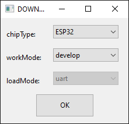
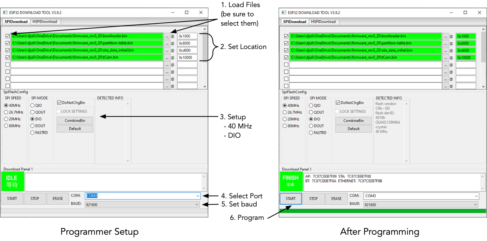

## tCam/tCam-Mini Firmware Serial Upload
There are three ways to load firmware into tCam.

1. Using the Espressif build process after compiling the firmware (or by using the Espressif ```idf.py``` command with the precompiled binaries).
2. Using a download tool from Espressif to load the pre-compiled firmware from this repository.
3. Using the Desktop application and the over-the-air (OTA) capability in tCam-Mini (FW Revision 2.0 and beyond) and all tCam FW revisions.

The second option is described here.  It requires a Microsoft Windows computer.

### Install the Espressif download tool
Download the `flash_download_tools_v3.9.3.zip` file to a Windows computer.  Unzip it in a known location.  It will unzip a directory named `flash_download_tools_v3.9.3`.  You will execute the ```flash_download_tools_v3.9.3``` binary from within that directory.

### Download firmware files
The firmware is comprised of four binary files which are found in the specific camera firmware/precompiled directories.

tCam files:

```
	firmware/precompiled/bootloader.bin
	firmware/precompiled/ota_data_initial.bin
	firmware/precompiled/tCam.bin
	firmware/precompiled/partition-table.bin
```

tCam-Mini files:

```
	firmware/precompiled/bootloader.bin
	firmware/precompiled/ota_data_initial.bin
	firmware/precompiled/tCamMini.bin
	firmware/precompiled/partition-table.bin
```

Download the four binary files from this repository to a known location.  All are required by the Espressif download tool and are loaded at the following locations in flash memory.

| File | Location |
| --- | --- |
| bootloader.bin | 0x1000 |
| partition-table.bin | 0x8000 |
| ota\_data_initial.bin | 0xd000 |
| tCam.bin / tCamMini.bin | 0x10000 |

### Connect Camera
Connect the camera to the Windows Computer to allow it to load a device driver for the camera's Silicon Labs USB-Serial chip.  tCam must be switched on for the USB-Serial chip to be visible.  After a few minutes the computer should load a driver and associate a COM port with the camera.  Make a note of this port.  You can find it in the Windows Device Manager.

### Start the Espressif download tool
Double-click the ```flash_download_tools_v3.9.3``` binary from within the installation directory.

A shell window will appear and then after a few seconds a selection window will appear.



Click the `ESP32 Download Tool` button.  The ESP32 Download Tool program runs and displays a new window.

#### Programmer Setup



1. Load the four firmware files from the location you stored them by clicking on the `...` buttons as shown above under the `SPIDownload` tab.  Select the appropriate tCam or tCamMini file depending on your camera (tCam shown in the image above).
2. Set the location in ESP32 memory for each file as shown above by clicking in the text fields to the right of each filename.
3. Configure the programming parameters in the `SpiFlashConfig` area.  Select SPI SPEED: 40 MHz, SPI MODE: DIO.
4. Select the COM port associated with the camera.
5. Set a fast baud rate of 921600 baud to reduce programming time.

#### Programming

1. Make sure the camera is on (tCam-Mini is on whenever connected to USB).  It will boot up but this does not matter (the programming software will reset it).
2. Press `START` to initiate programming.  A green progress bar will progress along the bottom of the window.  Programming should take 15-20 seconds.  The program will display `FINISH` upon a successful programming.
3. Reboot the camera.  For tCam turn the camera off by holding the power button for more than five seconds and then turn it back on by pressing the power button again.  For tCam-Mini, disconnect the camera and then reconnect it.  The camera should boot into the new firmware.

