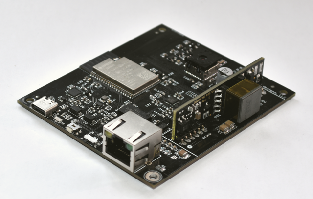
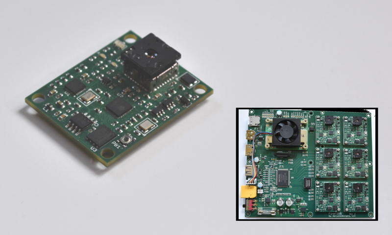
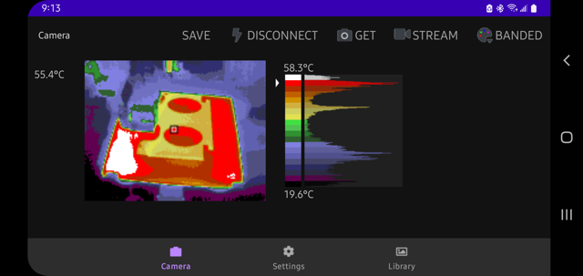

## ESP32-based Thermal Imaging Cameras
tCam, tCam-Mini, tCam-POE and tCam-Eth are four cameras I designed around the ESP32 and Lepton 3.5.  They are designed to provide easy access to radiometric data from the Lepton.  Radiometric data is useful because it contains temperature information for each pixel in the camera's image allowing for all kinds of data analysis even if the image is stored to a file.

This repository was created on Nov 6, 2022 from the ESP32 section of my original [Lepton](https://github.com/danjulio/lepton) repository to reduce the size of the portion of that directory that most people are interested in.

### tCam
tCam is a full featured, battery powered camera with a local touchscreen display, local storage and a WiFi interface.  It is comprised of a [gCore]() and tCam-Mini.  A tCam kit can be purchased from Group Gets [here](https://store.groupgets.com/products/tcam-kit).

### tCam-Mini
tCam-Mini is a smaller camera designed for streaming and remote access.  It supports a Wifi or hardwired interface.  It can be built using development boards or a tested unit can be purchased from Group Gets [with built in antenna](https://store.groupgets.com/products/tcam-mini-rev4-wireless-streaming-thermal-camera-board) or [with an external antenna](https://store.groupgets.com/products/tcam-mini-rev4-external-antenna-wireless-streaming-thermal-camera-board).

(Photo Credit: Matthew Navarro)

### tCam-POE
tCam-POE is a network only camera designed to work with hardwired POE connections (it also supports a Wifi connection).  At the moment, a grand total of six units have been built to validate the design (included here) or supply a custom order.

### tCam-Eth
tCam-Eth is a ethernet connected camera designed to be incorporated with other electronics.  It was designed as part the [FireTIRS](https://github.com/jthompson2710/FireTIRS) project but is made available as an open source hardware design.

### Desktop Application
All three cameras share a common command set for remote access.  A companion Desktop computer application may be used to configure and access the cameras, download new firmware, as well as perform some analysis.

### Android Application
Connect, view and save images on an Android phone using the [Android App](https://play.google.com/store/apps/details?id=com.danjuliodesigns.tcamViewer) by Jim Turner.  The source may be found at the [repo](https://github.com/yaturner/tcamViewer-DanJulio).

### IOS Application
Connect, view and save images on an iPhone or iPad using the [IOS App](https://apps.apple.com/us/app/tcamview/id1610451813).  Documentation may be found on my [website](https://danjuliodesigns.com/products/tcam_app.html).

### Web Server
A simple stand-alone server that can connect to multiple cameras, record images that meet certain criteria and display images from the cameras in a web browser.

### Python Driver
A simple driver to allow access from python programs makes it easy to write your own software to access the cameras.  The python driver supports either a network connection to any camera, or a hardwired connection to tCam-Mini from a Raspberry Pi.

### R Driver
Bob Rudus wrote a R driver for tCam-Mini that can be found in his [github repository](https://github.com/hrbrmstr/tcam).