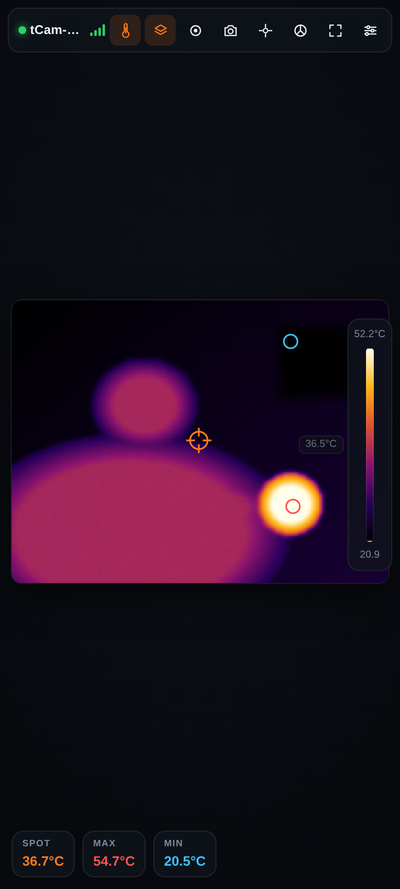

## ESP32-based Thermal Imaging Cameras
tCam, tCam-Mini, tCam-POE and tCam-Eth are four cameras designed by Dan Julio around the ESP32 and Lepton 3.5.  They provide easy access to radiometric data from the Lepton — per-pixel temperature information that survives into saved files and enables real analysis, not just pretty pictures.

This fork modernizes the **tCam-Mini firmware** into a fully self-contained instrument: the camera serves its own app to any browser, roams between WiFi networks, updates itself over the air, and needs no software installed anywhere.  The original json protocol on port 5001 is untouched, so every existing client — desktop app, Python scripts, mobile apps — keeps working.

### Quick start (this firmware)
1. Flash `tCam-Mini/firmware` (see [BUILDING_WINDOWS.md](tCam-Mini/firmware/BUILDING_WINDOWS.md)) — or upload a built `tCamMini.bin` through the web UI of any camera already running FW 4.0+.
2. Power the camera.  It joins a saved WiFi network, or broadcasts its own `tCam-Mini-XXXX` hotspot.
3. Connect and browse to **http://192.168.58.1/** (hotspot) or **http://tcam-mini.local** (your network).  That's the whole app.

| | |
|---|---|
|  |  |
| *Instrument-dense settings; the ⓘ button reveals help text.* | *Full toolbar and readouts on a phone.* |

More interface detail and screenshots: [WEB_UI.md](tCam-Mini/firmware/WEB_UI.md)

### Find the camera after it moves — tCam Finder

A saved browser shortcut freezes an IP address, but a camera that roams between houses
gets a different one at each location, so the shortcut opens a dead address. **tCam
Finder** fixes that with a page whose own address never changes: it asks the camera —
over Bluetooth LE — where it is *right now*, then opens its interface.

**➡️ [Open tCam Finder](https://mcgeaverbeaver.github.io/tCam/)** — save *this* page to
your home screen instead of the camera's IP.

| | |
|---|---|
|  |  |
| *Find by Bluetooth, plus every camera it has seen before.* | *[▶ Watch the demo](https://youtube.com/shorts/R_bb3d-skMs)* |

Bluetooth is used for **discovery only** — one read of the camera's name, current address
and mode. Video then streams over WiFi at full speed through the normal web interface.
There is no cloud service, no account and no backend: the page is static, all camera
traffic stays on your LAN, and the remembered-camera list lives only in your own browser.
Because the finder's origin is stable, that list survives the address changes that break
a camera-hosted shortcut.

* **Android / Windows / any Chrome or Edge** — *Find my camera*, pick it, done
* **iPhone / iPad / Mac** — no Web Bluetooth; the page offers the `.local` name instead, which mDNS keeps current
* **Camera in hotspot mode** — the page says so and points at `192.168.58.1`

Hosting is just GitHub Pages from [`docs/`](docs/) — fork the repo, enable Pages, and the
finder is yours. Details and the BLE contract: [docs/README.md](docs/README.md).

### What changed vs. the original firmware

| | Original (FW 3.x) | This fork (FW 6.15) |
|---|---|---|
| Viewer | Desktop/mobile app required | Any browser — nothing to install; up to 4 viewers at once |
| Streaming | json over TCP :5001 | Same, **plus** compact binary WebSocket to the browser |
| UI | — | Dark instrument UI: palettes, 640×480 upscale, isotherm, spot/probe, °C/°F |
| Recording | Desktop app | In-browser video + PNG, optional burned-in overlay |
| WiFi | One configured SSID | **Roams**: 5 saved networks, joins strongest in sight |
| Unreachable network | Camera unreachable | Own hotspot within seconds, auto-rejoins when found |
| Setup | App/serial | Captive portal: connect to hotspot, page opens itself |
| Firmware update | Serial / desktop app | Drag a .bin into the browser (safe A/B partitions) |
| Discovery | — | mDNS: `tcam-mini.local` + in-app camera finder |
| Find it after it moves | Re-discover by hand | **tCam Finder** page ([docs/](docs/)): Bluetooth LE asks the camera for its current address and opens it |
| Diagnostics | Serial cable | System log in the browser (Settings → System) |
| Sensor protection | — | Shutter parks over detector 10 s after last viewer leaves (sun protection) |
| Platform | ESP-IDF 4.4.4 (EOL 2024) | ESP-IDF 5.5, current drivers throughout |
| Protocol compat | — | Port 5001 json unchanged; `.tjsn` files identical |

Full engineering history: [tCam-Mini/firmware/readme.md](tCam-Mini/firmware/readme.md) · Web UI details: [WEB_UI.md](tCam-Mini/firmware/WEB_UI.md)

Also fixed along the way: command-parser buffer overruns, interrupt-driven Lepton vsync (was a busy-wait), event-driven response task, a display-string overflow, and a latent I2C port-number bug.  Upstream merge requests welcome — the work splits cleanly into fixes, platform port, and features.

### tCam-Mini
tCam-Mini is a smaller camera designed for streaming and remote access.  It supports a Wifi or hardwired interface.  It can be built using development boards or a tested unit can be purchased from Group Gets [with built in antenna](https://store.groupgets.com/products/tcam-mini-rev4-wireless-streaming-thermal-camera-board) or [with an external antenna](https://store.groupgets.com/products/tcam-mini-rev4-external-antenna-wireless-streaming-thermal-camera-board).

(image courtesy of Group Gets)
