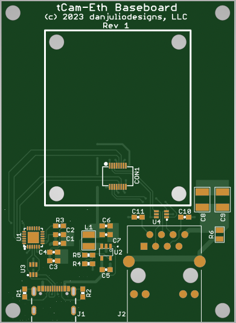

## tCam-Eth
tCam-Eth was developed for the [FireTIRS](https://github.com/jthompson2710/FireTIRS) project as a small ethernet connected thermal imaging camera.  It runs on 3.3V and exposes the TX and RX differential pairs from the ethernet PHY chip (it does not contain any magnetics), as well as a 3.3V logic serial interface.  It runs the tCam-Mini firmware, starting with version 3.0, and identifies as a tCam-POE device (configured for network operation).

A baseboard containing a USB UART chip and Magjack RJ45 ethernet connector was also developed and is used for initial programming and test of tCam-Eth boards.

This directory contains the hardware design and documentation for both boards.

1. Eagle V7.7 design files.
2. Gerbers (including paste layer for stencils).
3. Bill-of-Material (BOM).
4. Additional electronics documentation such as printed schematics, reference designator drawings, load list, etc.
5. Supporting mechanical designs for spaces and base mounts.

Please see the tCam-Mini directory for a detailed description of the command interface.

### Dimensions

tCam-Eth is 1.25 x 1.5" (31.75 x 38.10mm).

tCam-Eth Baseboard is 2 x 2.75" (50.8 x 69.85mm).

### Lepton Compatibility
tCam-Eth works with the following Lepton camera modules.

1. Lepton 3.0
2. Lepton 3.1R
3. Lepton 3.5

### Hardware Interfaces

#### tCam-Eth Hardware Interface
Connector CON1 (tCam-Eth PCB bottom) contains the following signals.

| Pin | Description |
| --- | --- |
| 1 | Ground |
| 2 | Ethernet TD+ (PHY output) |
| 3 | Ethernet TD- (PHY output) |
| 4 | Ground |
| 5 | Serial DTRN input (3.3V logic) |
| 6 | Serial RTSN input (3.3V logic) |
| 7 | Ground |
| 8 | +3.3V Power |
| 9 | +3.3V Power |
| 10 | Ground |
| 11 | Serial RX input (3.3V logic) |
| 12 | Serial TX output (3.3V logic) |
| 13 | Ground |
| 14 | Ethernet RX+ (PHY input) |
| 15 | Ethernet RX- (PHY input) |
| 16 | Ground |

The external 3.3V power supply must be regulated to +/- 5% and capable of supplying 500 mA (typical current consumption is < 200 mA).

#### tCam-Eth Baseboard Hardware Interfaces
Connector J1 is a USB-C connector used to provide power and serial communications.

Connector J2 is a RJ45 connector used to provide 10/100M bps ethernet communications.

### Operation
tCam-Eth is a command-based device.  It is designed for software running on another device to control it and receive responses and image data from it.  The command interface is described in the tCam-Mini firmware directory.

#### Ethernet Port
The ethernet port support an IEEE 803.2 10/100 Mbps ethernet interface.  tCam-Eth provides the direct TX and RX differential pairs from the on-board PHY chip.  It may be used in a direct connect fashion (as is done on the FireTIRS board) or with a traditional set of magnetics connected to an isolated RJ45 jack (as is done on the tCam-Eth Baseboard).

tCam-Eth can obtain a DHCP served address from a router on the network or may be configured with a static IP address.

#### Serial Port
tCam-Eth provides a 3.3V logic-level serial interface along with RTSN and DTRN flow-control inputs.  These are used to load firmware into the on-board ESP32 micro-controller (for example using the tCam-Eth Baseboard).  They may also be used to monitor the diagnostic serial output while the firmware is running.

#### Status Indicators
A dual-color (red/green) LED is used to communicate status (reference designator LED3).  Combinations of color and blinking patterns communicate various information.

| Status Indicator | Meaning |
| --- | --- |
| Off or Dim | Firmware did not start |
| Solid Red | Firmware is running: initializing and configuring the Lepton and Ethernet interface |
| Blinking Yellow | No ethernet network detected |
| Solid Yellow | Ethernet is connected and the camera has an IP address |
| Solid Green | Ethernet is connected and external software has connected via the socket interface |
| Fast Blink Yellow | Network Reset in progress |
| Alternating Red/Green | Over-the-air (network) FW update has been requested.  Press the button to initiate the update |
| Blinking Green | FW update in process (blinking my occur at irregular intervals as the Flash memory is written) |
| Series of Red Blinks | A fault has been detected.  The number of blinks indicate the fault type (see table below) |

| Fault Blinks | Meaning |
| --- | --- |
| 1 blink | ESP32 I2C or SPI peripheral initialization failed |
| 2 blinks | ESP32 Non-volatile storage or Network initialization failed |
| 3 blinks | ESP32 static memory buffer allocation failed (potential PSRAM issue) |
| 4 blinks | Lepton CCI communication failed (I2C interface) |
| 5 blinks | Lepton VoSPI communication failed (SPI interface) |
| 6 blinks | Internal network error occurred |
| 7 blinks | Lepton VoSPI synchronization cannot be achieved |
| 8 blinks | Over-the-air FW Update failed |

Additional start-up and fault information is available from the Serial interface.

A single-color yellow LED is used to communicate network Link/Activity (reference designator LED1).

A single-color green LED is used to communicate network 100 Mbit operation (reference designator LED2).

#### Network Reset Button
Pressing and holding the Network Reset Button for more than five seconds resets the network interface back to the default mode (requesting a DHCP served address).

Pressing the button quickly when an OTA FW update has been requested (LED alternating red/green) by the Desktop application initiates the update process.

#### mDNS Discovery
The cameras advertise themselves on the local network using mDNS (Bonjour) to make discovering their IPV4 addresses easier.

* Service Type: "\_tcam-socket._tcp."
* Host/Instance Name: Camera Name (e.g. "tCam-Mini-821F")
* TXT Records:
	1. "model": Camera model (always "tCam-POE")
	2. "interface": Communication interface (always "Ethernet")
	3. "version": Firmware version (e.g. "3.2")

### Mounting Hardware
Three supporting hardware pieces, designed using OpenSCAD, are designed to be 3D printed.  Both the OpenSCAD source and compiled STL files are included.

### Application spacer
The Application spacer is designed to mount tCam-Eth board to the application PCB via 4 M2x8mm screws, nuts and washers.  The cutout region aligns with the connector end of tCam-Eth.

### Baseboard spacer
The Baseboard spacer is designed to be mounted (carefully aligned) on the Baseboard using double-sticky tape or screws from the bottom.  It holds the tCam-Eth board in the correct position but makes it easy to insert and remove.

### Baseboard mount
The Baseboard mount is designed to hold the tCam-Eth Baseboard.  The Baseboard is screwed to the mount using #4, M3 or similar pointed screws.

