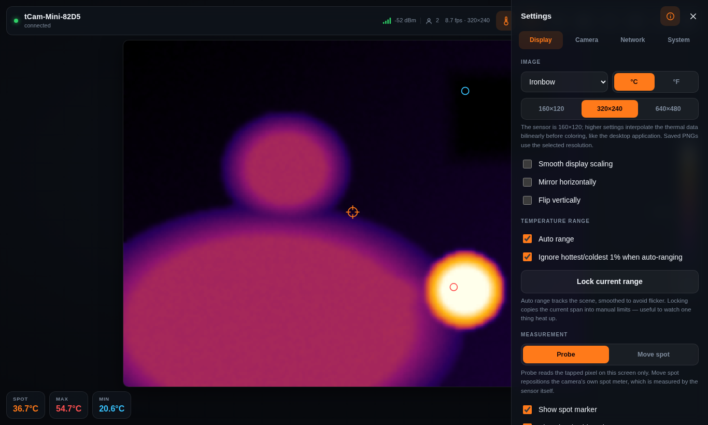

# tCam-Mini on-camera web interface

The camera serves its own user interface. Point a browser at it and you get a live
viewer, camera configuration, network setup, a system log and firmware updates —
with nothing installed on the client.

The desktop application, the Android application and the Python library all keep
working exactly as before. The web UI is an additional client, not a replacement,
and it speaks the same json command protocol over a WebSocket instead of a raw TCP
socket.


*The viewer. Floating readout chips (spot / max / min), temperature scale, spot and
hot/cold markers over the stream. Toolbar: scale, capture overlay, record,
screenshot, FFC, park shutter, fullscreen, settings.*

## Getting to it

**Straight out of the box (access point mode)**

1. Join the camera's WiFi network, `tCam-Mini-XXXX`.
2. Your phone or laptop should pop the interface up by itself. If it does not,
   browse to `http://192.168.58.1/`.

   (The camera's own network is 192.168.58.x specifically because the more common
   192.168.4.x collides with the LAN subnet some consumer routers hand out — a
   collision that makes the camera unreachable from any device that can also see
   that LAN.)

The camera answers every DNS query while it is an access point, so the operating
system's own connectivity check lands on the camera and triggers the usual
"sign in to network" prompt. That prompt *is* the app.

**On your own network (station mode)**

1. Open the web UI in access point mode, go to **Network**.
2. Press **Scan for networks**, pick yours, enter the password.
3. Tick **Connect to saved networks at startup** and save.

The camera then appears at `http://<camera-name>.local` — it advertises `_http._tcp`
over mDNS, so it also shows up in network browsers.

**Roaming.**  The camera remembers up to **five networks**. At power-on it scans
and joins the strongest one it can see, so one camera moves between locations
with no reconfiguration. Saved networks are listed on the Network tab (with a
Forget button each), and each may carry its own fixed IP address.

**Finding the camera after it moves (the tCam Finder).**  A saved browser
shortcut freezes an IP address, and a roaming camera's address changes between
locations.  The fix is the **tCam Finder** — a static page (docs/ at the
repository root, hosted on GitHub Pages or any HTTPS host) whose address never
changes.  It asks the camera itself for its current address over Bluetooth LE
(the camera advertises a small finder service from FW 6.15) and opens the
interface at whatever IP it holds right now.  The page remembers every camera
it has found for one-tap reopening.  Chrome/Edge only (Web Bluetooth); Apple
devices use `http://<camera-name>.local` instead, which mDNS keeps current.

**Recovery access point.**  If no saved network is in sight for about ten seconds,
the camera raises its own access point *while continuing to rescan every 30
seconds underneath*. Join `tCam-Mini-XXXX`, the captive portal opens, and you can
point the camera at a new network exactly like first-time setup. Nothing is
stored until you save: if a saved network comes back — a rebooted router — the
camera rejoins it and the recovery AP dissolves on its own. Moving between
locations therefore never needs a reset or a cable.

## What the interface does

The thermal stream owns the whole viewport; controls live in floating glass
surfaces and a slide-over settings panel. Explanatory text is hidden by default —
the **ⓘ button** in the panel header reveals the help paragraphs, and the choice
is remembered per device.

| Tab | Contents |
| --- | --- |
| Display | Palette, °C/°F, output resolution (160/320/640, bilinear), smooth scaling, mirror and vertical flip, auto/manual/locked range with 1% outlier clipping, probe/spot cursor, markers, isotherm alarm |
| Camera | Frame interval, gain mode, emissivity, AGC, FFC, shutter parking, live telemetry (FPA/housing temps, effective gain, emissivity, radiometry state), capture overlay, PNG and raw capture |
| Network | Camera name, camera discovery (mDNS), saved networks with per-network Forget, scan and join, fixed IP, hotspot mode |
| System | Model and firmware information, link quality, firmware update, clock, system log |

| | |
| --- | --- |
|  |  |
| *Settings are instrument-dense by default…* | *…and the ⓘ button reveals the explanations.* |
|  |  |
| *Camera tab with live sensor telemetry.* | *System tab: link quality, updates, log.* |

**Multiple viewers.**  Up to **four browsers stream at once** — phone on the couch,
PC at the desk — and any of them may change settings. The legacy TCP protocol on
port 5001 remains exclusive: while a desktop-app session is open, browsers are
told the camera is in use, and vice versa.

**Recording and screenshots.**  Record captures video (mp4 or webm, whichever the
browser encodes) at the selected output resolution, frame-accurate to the stream.
Recordings and screenshots save to the **viewing device's** Downloads folder — the
camera has no storage of its own; a recording is written when you press stop.
Screenshots and recordings share one compositor, and both honor the *capture
overlay* setting: burned-in camera name, timestamp, spot/max/min readouts,
temperature scale and markers — or a completely clean image. The overlay can be
toggled at any time, including mid-recording (layers button, or the O key).

**Isotherm alarm.**  Pixels at or above a chosen temperature render in a fixed
alarm color regardless of palette.

**Shutter parking.**  Ten seconds after the last viewer disconnects, the Lepton's
internal shutter closes over the detector, so a camera left pointing out a window
cannot take focused sun on its microbolometer; a new viewer reopens it, followed
by an automatic FFC. A park button in the toolbar and on the Camera tab does the
same on demand. The shutter is held closed electrically and springs open the
moment power is removed — a stored camera needs a physical cap, not the shutter.

**System log.**  System ▸ View system log shows the same output as the USB serial
console, kept in a ring buffer on the camera — debugging without a cable.

**Keyboard**: T scale · O overlay · R record · S screenshot · F fullscreen.

**Plain HTTP, deliberately.**  The camera serves only HTTP.  An HTTPS option
(with an on-device certificate authority) shipped in 6.6–6.8 and was removed:
on this microcontroller every TLS handshake runs on the same task that carries
the video stream, so each new connection — including every probe from a device
that had not installed the certificate — froze the stream for most of a second,
and the encrypted stream was visibly glitchy while plain HTTP was smooth.  On a
LAN camera the encryption bought nothing worth that cost.

Tap the image to drop a probe point (tap again to clear), or switch the cursor to
**Move spot** to reposition the camera's own spot meter — the reading measured by
the sensor itself.

The sensor is 160×120; the higher resolution settings interpolate the thermal data
bilinearly in the browser before coloring, the same way the desktop application
renders. **Save PNG** writes at the selected resolution. **Save raw** writes the
camera's own json frame with the `.tjsn` extension — the same format the desktop
application writes, so existing analysis tools still read it.

## How it is put together

The camera sends 16-bit radiometric frames exactly as it always has. All palette
mapping, scaling and measurement happens in the browser. Adding a palette or a
readout therefore costs the camera nothing, and the firmware never grew an image
renderer.

```
browser(s) ──HTTP──▶  esp_http_server  ──▶  index.html.gz  (embedded in the app image)
           ──WS────▶  web_cmd  ──▶  cmd_utilities  (the existing json command parser)
                                         │
           ◀──WS────  web_cmd broadcast  ◀──  rsp_task  ──▶  legacy TCP socket, port 5001
```

Image frames go to the browser as compact binary WebSocket messages (about 39 KB
each: header, telemetry, raw 16-bit pixels) rather than the 53 KB base64 json the
TCP protocol uses — the json framing still works, and the page understands both.

`web_cmd` keeps a table of connected browsers and broadcasts each frame to all of
them; a send failure drops just that viewer. All browsers share one command
parser, so the browser population and the legacy TCP client remain mutually
exclusive — the receive and response buffers in `cmd_utilities` are shared
singletons, and two interleaved clients would corrupt each other's packets. A
live owner keeps its session; only a dead one is displaced.

The UI is a single HTML file, gzipped to about 27 KB at build time and linked into
the application partition by `EMBED_FILES`. Keeping it there rather than on a
separate filesystem means an OTA update replaces the firmware and its interface
atomically — they can never be left at mismatched versions.

## Firmware updates

**System ▸ Choose firmware .bin** uploads `tCamMini.bin` directly to the camera.

The camera writes to the spare application partition and only switches the boot
target once the whole image has arrived and passed validation, so an interrupted or
corrupt upload leaves the running firmware untouched. Image streaming is suppressed
during an upload so that image frames are not competing with it.

This replaces the previous update path, in which the camera asked the host for each
chunk over the json protocol and gave up after a fixed number of retries. That
inverted the normal direction of control, required a bespoke implementation in every
client, and failed in ways the operator could not act on. The old protocol still
works for existing clients; nothing was removed.

## Building

`index.html` is the source of truth. `main/CMakeLists.txt` runs `compress_web.py`
at configure time to regenerate `index.html.gz` (and the app icons) **into the
build directory** — the generated files are not committed, because zlib output
differs between machines and a committed copy left every build with a dirty tree.

```
idf.py build
idf.py -p PORT -b 921600 flash
```

Requires ESP-IDF v5.5. `CONFIG_HTTPD_WS_SUPPORT` must be enabled — it is set in
`sdkconfig.defaults`, so a regenerated `sdkconfig` keeps the WebSocket endpoint.

## Notes and limits

- A frame is roughly 39 KB. On a marginal link, raising the frame interval on the
  Camera tab is by far the most effective stabiliser.
- AGC produces a higher contrast picture but the pixels stop being temperatures, so
  the readouts show "AGC" while it is on. The UI also watches the sensor's own
  radiometry flag in telemetry and refuses to dress raw counts up as degrees.
- The DNS responder only runs in access point mode. On a network with a real
  resolver, hijacking every query would be hostile.
- The interface is served over plain HTTP. It is intended for a camera on a local or
  point-to-point network, and there is no authentication — the same trust model the
  raw command port has always had.
- The screenshots on this page were rendered against a simulated stream for
  documentation; readouts and layout are the real interface.
