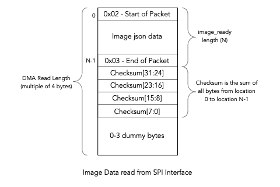

## tCam-Mini Firmware
tCam-Mini (tCam-POE) firmware is an Espressif IDF project.  You need to have the Espressif v5.5 IDF installed to build the firmware.  Pre-compiled binary files are provided (```precompiled``` directory here) and can be programmed using the IDF tools or a Windows utility as described in the ```programming``` directory elsewhere in this repostitory.

### On-camera web interface
The camera serves its own browser-based user interface, so a viewer and full configuration are available without installing the desktop or mobile application.  Join the camera's WiFi network and the interface appears by itself, or browse to ```http://<camera-name>.local``` when the camera is on your network.  See [WEB_UI.md](WEB_UI.md) for details.  The existing json command protocol on port 5001 is unchanged and all existing clients continue to work.

### Building
Setting up a Windows machine from scratch (IDF install, serial driver, and the
errors a new install reliably hits) is documented step by step in
[BUILDING_WINDOWS.md](BUILDING_WINDOWS.md).

The ```sdkconfig``` file contains ESP32 configuration and build-specific information.  All camera-specific configuration is in the ```main/system_config.h``` file.  The web interface source is ```main/www/index.html```; it is compressed and embedded in the firmware image at build time.

To build the project: ```idf.py build```

To load the project onto tCam-Mini or tCam-POE: 

1. Plug the board into your computer
2. ```idf.py -p PORT -b 921600 flash``` where PORT is the name of the serial port associated with gCore.

To monitor diagnostic information from the firmware: ```idf.py -p PORT```.  Output is at 115200 baud.  Note the command will reboot the camera.

### Revision History

#### FW 6.15
FW revision 6.15 adds the Bluetooth LE finder beacon, pairing with the hosted
tCam Finder page (docs/ at the repository root).

1. The problem: a browser shortcut freezes the camera's IP address, and a
roaming camera's address changes between locations - the saved shortcut then
opens a dead address where nothing of ours runs, and with plain http there is
no service worker that could intercept and rediscover.  The fix follows the
pattern of the stormcatcher project: a static HTTPS-hosted page (GitHub
Pages) whose address never changes, which asks the camera itself for its
current address over Web Bluetooth and then navigates to it.  All camera
traffic stays on the LAN; there is no backend and no account.
2. Firmware side: a NimBLE peripheral (main/ble_beacon.c) advertises a
custom finder service and answers a single characteristic read with
{"name","ip","mode"}, rebuilt on every read so it always reports the
current address.  Smallest possible footprint: BLE-only controller,
peripheral role only, one connection, classic-BT memory released at startup,
~300 ms advertising interval so the shared radio favors the image stream.
Startup logs the internal-heap cost.  Failure to start is logged and
non-fatal.
3. The finder page (docs/index.html) remembers every camera it has found in
its own localStorage - the page's origin is stable, so unlike the camera's
own pages this memory survives address changes - and offers one-tap open of
last-known addresses, quiet background refresh of previously-granted
cameras, and a .local fallback for Apple devices (no Web Bluetooth there).

#### FW 6.14
FW revision 6.14 removes the "Install as an app" button and prompt.

1. Browsers reserve one-tap app installation for trusted https origins, and
this camera deliberately serves plain http (see FW 6.9), so the button could
never do more than point at the browser's own menu.  A control that cannot do
what it offers is clutter: the Network-tab section and the phone install
prompt are gone.  The web app manifest and icons remain, so "Add to Home
screen" in the browser menu still produces a chrome-free app icon; the fixed-
address hint now speaks of bookmarks and home-screen shortcuts instead.

#### FW 6.13
FW revision 6.13 tightens the settings panel into an instrument-dense layout
with help on demand.

1. Explanatory text is now progressive disclosure: every hint paragraph is
hidden by default, and an (i) button in the panel header - next to close -
reveals them all.  The choice is remembered per device.  Two exceptions stay
visible because they are feedback rather than documentation: the install
button's instructions and the saved-networks empty state.
2. The Display tab's eight section headers consolidate to three: Image
(palette with the unit switch beside it, resolution, smoothing/mirror/flip),
Temperature range, and Measurement (cursor, markers, isotherm).  The capture
overlay toggle moves to the Camera tab's Capture section, next to the save
buttons it governs.
3. Section and row spacing tightened throughout the panel.

#### FW 6.12
FW revision 6.12 corrects documentation that overstated what parking the
shutter protects.

1. The Camera tab hint and the confirmation toast both described a parked
shutter as "a safe state to unplug in".  It is not.  The Lepton holds its
shutter closed electrically - the flag is actively driven, not latched, which
is why the FLIR SDK's shutter-position enum carries a BRAKE_ON state - so it
springs back open the instant power is removed, and the Lepton's own processor
dies at the same moment ours does.  No firmware can hold it.  Parking protects
a camera that is powered and unattended, which is the realistic sun-exposure
case; protecting a stored camera needs a physical cap over the aperture.  The
UI now says exactly that, and repeats that the shutter sits behind the lens so
it never protects the lens itself.  No functional change.

#### FW 6.11
FW revision 6.11 fixes video recordings never saving, restores the photo
button on phones, and adds a vertical flip.

1. Stopping a recording nulled the recorder object before the browser fired
its stop event; the save handler then read through that null and threw -
silently, inside an event handler - so the file was never written.  The
handler now uses the event's own recorder reference, and both start and stop
show a toast (recordings save as .mp4 or .webm to the device's downloads,
like photos).
2. The phone toolbar hid the Save PNG button to save space; there is room, so
every action button now shows on mobile.  Only the passive fps and status
texts still yield.
3. "Flip vertically" joins "Mirror horizontally" in the display settings, for
cameras mounted upside down.  Both are display-side transforms applied
consistently to the live view, tap targets, markers, screenshots and
recordings, and both are remembered per device.

#### FW 6.10
FW revision 6.10 makes Lepton mode changes verified, and makes the UI honest
when the sensor is not producing temperatures.

1. The runtime sensor writes - AGC on/off, emissivity, gain - fired their CCI
commands and trusted them.  The note at the top of lepton_utilities.c has
warned since Dan wrote it that Lepton commands sometimes fail silently, and
boot-time init has always verified its writes with read-back and retry; the
runtime paths now do the same and log the verified result (visible in the web
System log).  The dangerous case this closes: turning AGC off issues two
writes (radiometry TLinear on, AGC off), and if the TLinear write dropped, the
sensor was left producing raw uncalibrated counts that the UI formatted as
absurd "temperatures".
2. The UI now reads the sensor's own radiometry flag from telemetry (row C
word 48) every frame.  If the sensor reports TLinear off while AGC is off, the
readouts say "no cal" instead of nonsense degrees, the scale says "raw", the
isotherm and capture overlay suspend, and a new "Radiometry (T-Linear)" row in
the System tab's telemetry section names the state.  Toggling AGC on and off
again (now verified) or rebooting restores radiometry.

#### FW 6.9
FW revision 6.9 removes HTTPS support entirely.  The camera serves plain HTTP
only.

1. Why: esp_https_server performs every TLS handshake synchronously on the same
task that carries the WebSocket video stream.  Each new connection - including
every retry from a device that had not installed the camera's CA, and every
OS connectivity probe aimed at port 443 - stalled the stream for most of a
second of ECDHE math, which showed up as constant glitching and torn frames
over wss while the identical stream over ws was smooth.  That is an
architecture limit of the IDF server on this part, not a tuning problem, so
the feature was removed rather than left half-working.  What HTTPS bought
(encryption on a LAN, and Chrome's one-tap PWA install) was not worth a video
stream that could not hold rate.
2. Removed: the HTTPS server instance (port 443), the on-device certificate
authority and certificate generation (cert_utilities), the /ca.crt download,
and the Security section of the web UI.  Certificates stored in NVS by
6.6-6.8 are erased on first boot of 6.9 to reclaim the space.  "Add to Home
screen" still gives a chrome-free app icon on phones; only Chrome's one-tap
install banner (which requires trusted https) goes away.
3. The freed socket pool lets the HTTP server accept 6 connections (was 3
per instance), giving the four-viewer streaming limit real headroom.

#### FW 6.8
FW revision 6.8 lets every connected browser view at once, and fixes a
range-arithmetic bug that rejected the emissivity setting.

1. Multi-viewer streaming.  Up to four browsers now connect simultaneously and
all receive the image stream; any of them may issue commands.  The single-owner
session model - inherited from the TCP protocol and the source of both the
6.6 session tug-of-war and 6.7's "camera in use" refusals between one user's
own devices - is gone for browsers.  The legacy json TCP client remains
exclusive with browser clients (one shared command parser).  Failed sends drop
just that viewer; browsers reconnect on their own.  WebSocket connect logs now
say ws (http) or wss (https), so the log shows which transport a viewer used.
2. Setting emissivity to 1% put the Lepton's scene-emissivity parameter one
count below its documented minimum (integer truncation: 1% of 8192 = 81, the
floor is 82), so the sensor rejected the whole radiometry parameter block with
LEP_ERROR_RANGE (-3) at every boot and the setting silently never applied.  The
scale now rounds up; every percentage 1-100 lands in range.  If a camera's
stored emissivity reads 1%, re-apply the intended value from the Camera tab.
3. Housekeeping: 6.7's release script wrote its version stamp to the wrong
path, so 6.7 reported itself as 6.6 while carrying 6.7 code; removed.

#### FW 6.7
FW revision 6.7 stops a second viewer from tearing the stream away from the
first.

1. The 6.6 claim-on-first-frame let any newly connecting browser silently take
the command session from whoever held it.  With two tabs or two devices open,
each steal killed the other viewer's stream, its automatic reconnect stole the
session back, and the camera ping-ponged between them every few seconds -
which read as everything being broken while each individual connection was in
fact working.  A newcomer now probes the current owner first: a live owner
keeps the session and the newcomer is told "Camera is in use by another
viewer" (shown as a toast); only a dead owner is displaced.  Closing the
owning tab frees the camera within moments.

#### FW 6.6
FW revision 6.6 gives the camera its own certificate authority, unlocking fully
trusted HTTPS.

1. The camera now mints a tiny CA on first boot (once, ever) and signs its
server certificate with it, serving the full chain.  Settings -> System ->
Security offers the CA for download (`/ca.crt`) with per-OS install
instructions.  A device that installs it sees the camera as fully trusted:
green-lock https with no warnings, encrypted video (wss) working - the entire
https-video limitation disappears - and the browser willing to offer real
one-tap app installation, which requires a secure context that a self-signed
certificate can never provide.  Devices that skip the install keep exactly the
previous behavior.
2. The CA is created once and survives camera renames; the server certificate
reissues freely underneath it without re-installing anything.  The certificate
format version bumps, so cameras upgrade their stored certificate to the
CA-signed chain automatically on first boot - browsers that had accepted the
old self-signed certificate will show their warning once more (or nothing at
all, once the CA is installed).

#### FW 6.5
FW revision 6.5 fixes a boot crash introduced by 6.4's log capture.

1. The 6.4 log hook placed a 256-byte buffer on the stack of every task that
logs.  lep_task's stack was sized in the IDF 4.4 era with no margin for that,
and it overflowed during Lepton init - a boot loop, with stack corruption
garbling the emissivity readout on the way down.  The hook now formats into a
static scratch buffer under the ring mutex (near-zero cost on the calling
task's stack), and the thin task stacks from the original firmware get modern
headroom: lep_task 2304 to 3072, rsp_task 2816 to 3328, ctrl_task 2176 to 2560.
2. The "video cannot run over HTTPS" prompt now remembers its answer.  OK makes
every future https visit hop to the http address automatically; Cancel keeps it
quiet apart from the status line.  It asks exactly once per browser.

#### FW 6.4
FW revision 6.4 reverts the FFC policy change and adds a web-visible system log.

1. The 6.3 FFC-cadence write is removed entirely.  In the field it coincided
with a large radial gradient that survived cold starts and manual FFC alike -
symptoms of a mis-programmed FFC policy, not of drift.  The write was guarded
by a layout check, but a guard cannot prove field meanings, so the change is
withdrawn rather than adjusted.  The Lepton runs on FLIR's own FFC defaults
again (the setting was volatile - never saved into the sensor - so no camera
retains it after this update).
2. The System tab gains a live system log: the same output as the USB serial
console, captured into a 16KB ring in PSRAM and served at `/api/log`.  Debugging
no longer requires a cable.
3. The 1%-outlier clipping in auto-range is now a Display-tab toggle (default
on, remembered).  Turning it off shows the absolute extremes - necessary when
validating the sensor rather than reading a scene.

#### FW 6.3
FW revision 6.3 recalibrates more aggressively against self-heating, and
reworks the mobile toolbar.

1. The automatic flat-field-correction cadence is tightened: an FFC every 120
seconds or 1.5 degC of FPA drift, from FLIR's defaults of 180 s / 3.0 degC.
The defaults assume FLIR's reference thermal design; mounted over a busy WiFi
SoC the housing warms continuously, and the drift between corrections was
large enough that the warm corners could capture the Max reading - a
measurement problem, not just a cosmetic one.  Halving both bounds keeps the
residual gradient a fraction of what it was, at the cost of hearing the
shutter a little more often.  The change is a read-modify-write of the
Lepton's FFC policy object and refuses to write if the read-back does not
match the documented layout.
2. Mobile toolbar: every action button is now visible on a phone (previously
FFC was hidden and the bar could overflow); the pause/play button is gone
everywhere - the stream is simply on while a viewer is connected - and the
shutter park control sits in the toolbar next to FFC rather than only in
settings.
3. On phones, when the page is not running as the installed app, a one-time
banner offers to install it; "Not now" is remembered and it never asks again.

#### FW 6.2
FW revision 6.2 parks the shutter over the idle detector and ranges the display
like a thermal instrument.

1. The Lepton's internal shutter sits between the lens and the detector, and it
is now used as armor for the one component it can protect.  Ten seconds after
the last viewer disconnects, the shutter is commanded closed over the detector -
so a camera left pointing out a window cannot take focused sun on its
microbolometer, the one thing that reliably damages one through the lens.  A
newly connecting viewer reopens it, followed automatically by a flat field
correction so every session starts freshly normalized.  A "Park shutter" button
on the Camera tab closes it on demand; running FFC reopens a parked shutter.
Note the shutter cannot protect the lens itself - it is behind the lens;
scratches and dust need a cap.  (This entry originally described parking as
something done "before unplugging"; that was wrong - see FW 6.12.)  New
`set_shutter` json command ({"park":0|1}).
2. Display auto-ranging maps the 1st-99th percentile of each frame instead of
the absolute minimum and maximum.  A handful of outlier pixels - one hot
reflection, or the warm corners the optics produce as the housing heats between
flat field corrections - used to own both ends of the palette and flatten the
rest of the scene, which is also what made mild corner vignetting so loud.  The
Max/Min readouts still report true extremes; only the color mapping clips its
tails, which is how purpose-built thermal viewers range.  On the vignetting
itself: the radiometric data is passed through untouched by this firmware, and
the corner gradient is the optics' own thermal drift since the last FFC - it
accumulates as the housing warms.  The park/reopen cycle above means every
viewing session now begins with a fresh FFC, which is the real mitigation;
pressing FFC clears it at any time.

#### FW 6.1
FW revision 6.1 tightens the installed-app experience and adds an escape hatch
from the captive-portal window.

1. The manifest gains a stable app `id` and `launch_handler: focus-existing`,
so opening the camera focuses the already-running installed app instead of
stacking a second copy - the closest the web platform comes to "launch the
installed app".
2. No operating system lets a captive portal auto-launch an installed app; the
"sign in to network" flow belongs to the OS and the network side cannot reach
into it.  What the camera can do is make leaving that window one tap: when the
UI detects it is running inside Android's restricted sign-in WebView, it shows
a bar offering "Open in browser", which escapes to the default browser via an
intent URL - where the installed app is directly available.  Cameras without
the app installed keep exactly the previous behavior; the bar is dismissible
and never appears in a normal browser or in the installed app.

#### FW 6.0
FW revision 6.0 teaches the camera to roam: it remembers up to five WiFi
networks and joins whichever one it can see.

1. At power-on the camera scans, finds the strongest saved network on the air,
and joins it - so one camera moves between home, cottage and workshop with no
reconfiguration.  When none of its networks are visible it broadcasts its own
hotspot within seconds of boot (previously it retried blind for a minute or
more first) and keeps scanning every 30 seconds underneath, so carrying it into
a known house connects automatically.  Joining a network from the UI adds it to
the saved list; the Network tab lists saved networks with a Forget control.
A static address, where configured, is stored per network - fixed at home,
DHCP everywhere else.  Networks that hide their SSID cannot be roamed to (they
are invisible to the scan); broadcast-SSID networks are required.
2. Upgrades are seamless: the previously configured network is carried into the
saved list automatically.  The json protocol gains `forget_wifi`, and `get_wifi`
now reports the saved list (names only - passwords never leave the camera).
`set_wifi` behaves as before and additionally saves the network.
3. The I2C driver is migrated off the legacy API the boot log warned about
("this is an old driver").  The old code also passed a mode constant where a
port number belongs - harmless only because both happened to equal 1; the new
bus/device API makes that mistake unrepresentable.
4. TCP buffering is raised from 8 to 12 segments per socket, letting more of
each ~38KB frame queue per write on lossy links.

#### FW 5.6
FW revision 5.6 fixes the video stream for ESP-IDF v5: the WebSocket session
was never being claimed.

1. IDF 4.4 invoked the WebSocket URI handler for the upgrade GET, and that is
where the camera registered the browser as its client.  IDF 5 completes the
handshake internally and deliberately never calls the handler for the upgrade
(`httpd_uri.c`: "If the request is websocket handshake, then do not call the
uri->handler").  So under IDF 5 the browser's connection opened successfully -
the page truthfully said "connected" - while on the camera no client existed,
and the ownership check rejected the browser's first command as coming from an
unknown socket, closing the connection.  The browser reconnected every two
seconds, forever.  The 5.4 stage logging plus the 5.5 noise cleanup made the
failing stage visible: handshake yes, first command never.
2. The session is now claimed when the first data frame arrives on a socket
that holds no session, which is the correct model for IDF 5.  The IDF 4 GET
path is retained for compatibility.
3. This was the second break of the same feature with identical symptoms.  The
first (FW 5.1) was the handler-table overflow introduced alongside camera
discovery; this one arrived with the IDF 5 platform move in FW 5.0.  Camera
discovery itself was not at fault either time.

#### FW 5.5
FW revision 5.5 dials the video connection before anything else, and clears the
probe noise out of the AP-mode log.

1. The 5.4 instrumentation showed the WebSocket request never reaching the
camera at all: the page loads, every panel works, and no `/ws` dial appears on
the wire.  The dial was the last line of page boot, so any earlier boot step
throwing in a restricted browser context - captive-portal sign-in windows are
the prime suspect - silently killed it while leaving the rest of the page
working.  The connection now dials first, the remaining boot is fenced so no
secondary feature can take the video down with it, and the status line shows
"connecting…" from the moment the script starts.
2. In access point mode the captive portal's DNS answers every hostname, so
every phone and PC on the AP aims its connectivity and secure-DNS probes at the
camera's TLS port, rejects the certificate, and produces an error line several
times a second - a flood that has repeatedly buried the log lines that matter.
Those probes carry no information in AP mode and are silenced there; station
mode keeps full TLS error reporting.

Note: the auto-opened "sign in to network" window is a restricted browser.  If
the video does not start there, open `http://192.168.58.1/` in the real browser
- the page itself now says exactly what state the video connection is in.

#### FW 5.4
FW revision 5.4 makes the video pipeline account for itself, stage by stage.

The binary WebSocket streaming path shipped in FW 4.1 - after the WebSocket
endpoint had already silently stopped registering (fixed in 5.1) - so it had
never once run against a real browser until now.  Every stage now reports in
the serial log the first time it happens per connection:

1. `ws client N connected from <ip>` - the browser reached the endpoint.
2. `First command received from ws client N` - commands are flowing inbound.
3. `Stream on: N mS delay, N frames` - the stream command was parsed and
   accepted by the response task.
4. `First image frame sent to ws client N (N bytes)` - a frame actually left
   the camera.

The browser shows its half: if the socket is open but no frame arrives within
four seconds, the status line reads "connected — no frames from camera" rather
than a bare "connected".  Whichever line is missing names the broken stage.

#### FW 5.3
FW revision 5.3 fixes a crash in the UI and makes an unusable page say why.

1. Tapping the image before the first frame arrived threw a TypeError out of the
click handler - the readout code indexed the pixel array while it was still
null.  The marker moved, every readout went stale, and the console filled with
`Cannot read properties of null`.  Readouts now show "--" until a frame exists.
2. When the page is served over HTTPS the video connection cannot be made:
browsers accept a self-signed certificate for pages but refuse to extend that
same exception to a WebSocket, and nothing on the camera can override it.  The
UI detected this only after five failed attempts, which the reconnect backoff
stretched to nearly forty seconds - long enough to read as a dead page.  It now
says so on the first failure and offers the HTTP address, which streams normally.
3. Unhandled requests are logged with the URI they asked for.  An unregistered
endpoint is answered by the captive-portal redirect rather than refused, so
without this a missing route looks exactly like a working one - which is how a
missing `/ws` stayed hidden for several releases.
4. The captive-portal redirect carries an HTML body as well as the Location
header.  Windows' portal window and several phone portal browsers render the
response instead of following the redirect, and an empty document left them on
a blank page or their own home page, which reads as the portal having failed.

#### FW 5.2
FW revision 5.2 makes the recovery access point actually usable while it is up.

1. Once the fallback AP was raised, the station kept retrying the unreachable
network back-to-back - each attempt parking the radio off-channel for a couple
of seconds - and the retry path blocked the system event task for a second per
cycle.  The AP that exists precisely for this situation was stuttering under
everyone connected to it: pages stalled, fetches timed out ("Discovery failed"),
and the whole camera felt broken.  Reconnects are now scheduled from a one-shot
timer (the event handler never blocks), and once the fallback AP is up the
station retries every 30 seconds instead of continuously.  Auto-rejoin when the
home network returns is unchanged, just calmer.
2. The WiFi scan now works from the recovery AP.  The driver refuses to scan
while the station is mid-connect, and with an unreachable network configured the
station was mid-connect nearly all the time - so the settings page showed no
networks in exactly the situation where the user needs the list to fix the
configuration.  The scan endpoint now aborts any connect attempt in flight,
holds reconnects off while the scan runs, and re-arms them afterwards.
3. Camera discovery always returns at least the camera answering the request.
mDNS deliberately does not answer its own queries, so with one camera - and
always when the client is connected straight to the camera's own AP - the picker
came back empty and looked broken.  The camera now lists itself (the UI marks it
"this camera"), other cameras found by mDNS follow, and an mDNS query failure is
logged rather than reported as a failed discovery.

#### FW 5.1
FW revision 5.1 fixes the WebSocket endpoint never being installed.

1. `esp_http_server` allows eight URI handlers by default.  This server registers
nine, and registered the WebSocket last, so `/ws` was the one that did not fit.
The return value was not checked, so nothing said so.  Requests to `/ws` then
fell through to the 404 handler, which redirects for the captive portal - and a
browser opening a WebSocket that receives a 302 instead of a 101 fails
immediately, before the connection opens.  The handler table is now sized with
headroom, the WebSocket is registered first, and every registration reports its
own failure.
2. This is the actual cause of the symptom reported since FW 4.0: the page
loads, the settings panels are live, the signal strength and client count
update - all of which are plain HTTP - while the image never arrives and the
sensor readouts stay blank.  Only the stream travels over the WebSocket.  The
fault arrived with `/api/discover` (the ninth handler) in the camera discovery
release, which is why it appeared alongside that feature.
3. The repeating mbedTLS `-0x7780` alerts were real but unrelated: a browser
retrying a WebSocket that could never succeed, aborting each handshake.  They
were a symptom of this bug over HTTPS, not a second fault, and the earlier
releases that chased them were treating the noise rather than the cause.
4. Log suppression is narrowed.  `httpd_uri` warns - and only warns - when the
handler table is full, and FW 4.1 had silenced that tag to ERROR, hiding the one
message that named the fault.  Warnings from it are logged again, and `httpd`
keeps its errors so a server that fails to bind can still say so.

#### FW 5.0
FW revision 5.0 moves the firmware from ESP-IDF v4.4.4 to v5.5.

1. v4.4.4 was the last release of the v4 line, reached end of life in 2024, and
has since been withdrawn from Espressif's download page - so the firmware could
no longer be built with a toolchain anyone could obtain, and the WiFi and TLS
stacks it shipped were receiving no fixes.  The build now targets v5.5.
2. `mdns` left the IDF after v4.4 and now lives in the component registry.  It is
vendored into `components/mdns` (release 1.9.1) rather than fetched at build
time, so a build needs no network access and cannot break when a remote version
moves.  Camera discovery and `<name>.local` are unchanged.
3. mbedTLS moved from 2.28 to 3.6, which made key structures private and changed
several signatures.  Certificate generation and verification were updated for
it: raw serial numbers instead of the deprecated mpi setter, the accessor for a
keypair's curve, and an RNG passed to key parsing (the hardware generator is
used directly rather than standing up a second entropy pool).  The certificate
produced is the same EC P-256, and stored certificates survive the upgrade.
4. `httpd_ssl_config_t.cacert_pem` no longer doubles as the server's own
certificate - in v5 that field means the CA used to verify client certificates.
The server identity is now set through `servercert`, which is the actual fix for
a field whose meaning silently changed.
5. Ethernet MAC configuration, several headers split out of `esp_system.h`
(`esp_mac.h`, `esp_random.h`, `esp_app_desc.h`, `esp_timer.h`), the removal of
the socket API from `esp_http_server.h`, and the `portTICK_RATE_MS` macro were
all updated for v5.
6. Configuration is now generated from `sdkconfig.defaults`, which records every
deliberate deviation from the IDF defaults and the reason for it, so the next
IDF upgrade is a review of one annotated file rather than a diff of a thousand
generated lines.
7. Two latent defects surfaced by the newer compiler are fixed: a display time
string built with an unbounded `sprintf` into a 26 byte buffer, which an RTC
holding an out-of-range date could overrun, and `IRAM_ATTR` applied twice to the
Lepton vsync ISR and the SPI slave callbacks, where the second placement was
being discarded.

Behaviour is unchanged - this release is the platform move, not a feature
release.

#### FW 4.7
FW revision 4.7 fixes peer attribution: with IPv6 enabled the server listens on
an IPv6 socket and IPv4 clients arrive as v4-mapped addresses (::ffff:a.b.c.d),
which the 4.5 logging did not decode - every peer printed as "unknown".  Page
fetches and WebSocket connects now log real IPv4 addresses.

#### FW 4.6
FW revision 4.6 handles browsers that refuse WebSockets to self-signed certificates.

1. Diagnosis from the field: with the certificate accepted, pages and API calls complete over HTTPS, but some browsers refuse to apply the certificate exception to wss:// connections - so settings panels stay live while the video never arrives, and the camera logs a client fatal alert (-0x7780) at each reconnect attempt.  No amount of re-accepting fixes this; it is browser policy.
2. The UI now detects the pattern (WebSocket refused before opening while on an https origin) and offers a one-tap switch to the HTTP origin, where streaming is unaffected.  The System tab documents the limitation.  The previous guidance ("reload and re-accept") was wrong for this state and is gone.

#### FW 4.5
FW revision 4.5 adds connection attribution to the log: UI page fetches log the
client address and transport (http/https), and WebSocket connects log the peer
address.  When something on the network misbehaves against the camera, the log
now names an address instead of leaving the operator guessing which device.

#### FW 4.4
FW revision 4.4 fixes the stream dying while the settings stayed live.

1. The HTTP server's least-recently-used purge only counts a socket as active when it receives a request, and the streaming WebSocket is almost pure outbound - so whenever the browser opened a new HTTP connection (the 5 s status poll, the app icons), the frame-carrying socket looked idle and was evicted first.  Symptom: image gone, "disconnected - retrying", while every HTTP-backed panel stayed perfectly live.  Every outbound frame now refreshes the socket's activity counter, and the UI sends a small keepalive while the stream is paused.

#### FW 4.3
FW revision 4.3 makes the TLS certificate stable for the camera's life.

1. The certificate is no longer reissued when the camera's address changes.  Browsers store the self-signed-certificate exception against the exact certificate bytes, so every DHCP change voided every stored acceptance - producing a fresh warning per address and leaving stale open pages hammering the camera with silently rejected handshakes (the repeating -0x7780 in the log).  The certificate is now bound to the camera name only and issued once.
2. The web UI backs off its reconnect attempts toward 30 seconds, stops status polling while its tab is hidden, and - when a secure connection is refused before ever opening - tells the user the one action that fixes it: reload the page and re-accept the certificate.

#### FW 4.2
FW revision 4.2 reverts the PSRAM overclock from 4.1 and restores TLS failure diagnostics.

1. PSRAM returned to 40 MHz.  The 80 MHz setting in 4.1 was a speculative optimization with no measured benefit, and it coincided with TLS handshake failures - every mbedTLS allocation comes from PSRAM (CONFIG_MBEDTLS_EXTERNAL_MEM_ALLOC), so marginal PSRAM corrupts crypto working memory.
2. Log suppression corrected: 4.1 silenced the tag carrying the mbedTLS error code while keeping a contentless echo, making handshake failures undiagnosable without a rebuild.  The reason is logged again; only the redundant echoes are dropped.

#### FW 4.1
FW revision 4.1 is a streaming efficiency release.

1. The web UI receives image frames as raw binary over the WebSocket instead of base64 json - 27% fewer bytes per frame and no per-frame base64/cJSON work on either end.  The json protocol on port 5001 is unchanged; saved .tjsn files remain desktop-compatible.
2. PSRAM clock raised from 40 to 80 MHz (all large buffers live there).  If a camera shows instability on marginal silicon, revert CONFIG_SPIRAM_SPEED_80M to 40M.
3. Explicit "Switch to hotspot mode" control and static-address configuration in the Network tab.

#### FW 4.0
FW revision 4.0 makes the camera self-contained.

1. On-camera web interface (viewer, configuration, capture, OTA update) served from the camera itself over HTTP and HTTPS - no application install needed.  See [WEB_UI.md](WEB_UI.md).
2. Captive portal in access point mode; AP moved to 192.168.58.1 and the stored AP address is now actually applied to the interface.
3. Per-camera self-signed TLS certificate generated on-device (EC P-256, valid to 2050).
4. Interrupt-driven Lepton vsync and event-driven response dispatch.
5. Fixed command parser out-of-bounds accesses, an RX buffer overflow, the station-mode IP address never being recorded (IP_EVENT_ETH_GOT_IP vs IP_EVENT_STA_GOT_IP), and a 53 KB image buffer needlessly held in internal DMA memory on network interfaces.

#### FW 3.2 (8/22/2023)
FW revision 3.2 is a minor change to properly identify the Lepton 3.1R module.

1. Moved to Espressif IDF 4.4.4.
2. Properly identify Lepton 3.1R (previous firmware would only identify Lepton 3.1 prototype).

#### FW 3.1 (9/1/2022)
FW revision 3.1 fixes issues and enhances Lepton support.

 1. Moved to Espressif IDF 4.4.2 (now using esp_netif, adjusted task priorities, stack size).
 2. Support 63 character WiFi passwords.
 3. Fixed bug with Lepton detection.
 4. Fixed bug where WiFi restart fails when setting client mode with static IP.

#### FW 3.0 (8/6/2022)
FW revision 3.0 is a major new release.  It is designed to run on tCam-Mini and tCam-POE PCBs with Revision 3 silicon and 8 MB Flash memory).

1. Support tCam-POE board
2. Optimize flash reads for improved performance
3. Added mDNS for camera discovery
4. Changed model usage to support tCam-POE (model 2 is for tCam-Mini board, model 3 is for tCam-POE board)
5. Added Interface Type flags to model number
6. Add timeout to SPI slave read
7. Blink error LED if SPI Slave fails
8. Fix bug where unknown json command would crash camera

#### FW 2.1 (2/5/2022)
FW revision 2.1 fixes the following issues.  It is designed to run on the tCam-Mini PCBs with Revision 3 silicon and 8 MB Flash memory (camera's built using Revision 1 silicon or less than 8 MB Flash memory should use FW revision 1.3).  It fixes an issue where setting a password of less than 8 characters would brick the tCam-Mini (requiring reload of firmware using the Windows utility).

1. Prevent updating Wifi password if the length is less than 8 characters to avoid a condition where the ESP32 wifi library fails on boot and the camera can't be reconfigured.
2. Add the ability to reset WiFi even when the camera has detected a hardware fault on boot (backup solution to #1 above).

#### FW 2.0 (11/23/2021)
FW revision 2.0 adds the following new features.  It is designed to run on the tCam-Mini PCBs with Revision 3 silicon and 8 MB Flash memory (camera's built using Revision 1 silicon or less than 8 MB Flash memory should use FW revision 1.3).

1. Faster performance - often reaching the full 8.7 fps over WiFi.
2. Support for Lepton 3.0.
3. Support for OTA FW updates (from the Desktop Application 2.0). It won’t be necessary to use the serial IF and Espressif utility to load new firmware releases after 2.0 is loaded.
4. Support for a new HW Slave interface (available on PCB revision 4) for direct connect to another Micro (I use this for tCam).

### Command Interface
The camera is capable of executing a set of commands and generating responses or sending image data when connected to a remote computer via one of the interfaces.  It can support one remote connection at a time.  Commands and responses are encoded as json-structured strings.  The command interface exists as a TCP/IP socket at port 5001 when using WiFi or Ethernet.

Each json command or response is delimited by two characters.  A Start delimiter (8-bit value 0x02) precedes the json string.  An End delimiter (8-bit value 0x03) follows the json string.  The json string may be tightly packed or may contain white space.

```<0x02><json string><0x03>```

The camera currently supports the following commands.  The communicating application should wait for a response from commands that generate one before issuing subsequent commands (although the camera command buffer is 12,288 bytes (sized for the ```fw_segment``` command) and can support multiple short commands).

| Command | Description |
| --- | --- |
| [get_status](#get_status) | Returns a packet with camera status.  The application uses this to verify communication with the camera. |
| [get_image](#get_image) | Returns a packet with metadata, radiometric (or AGC) image data and Lepton telemetry objects. |
| [set_time](#set_time) | Set the camera's clock. |
| [get_config](#get_config) | Returns a packet with the camera's current settings. |
| [get\_lep_cci](#get_lep_cci) | Reads and returns specified data from the Lepton's CCI interface. |
| [run_ffc](#run_ffc) | Initiates a Lepton Flat Field Correction. |
| [set_config](#set_config) | Set the camera's settings. |
| [set\_lep_cci](#set_lep_cci) | Writes specified data to the Lepton's CCI interface. |
| [set_spotmeter](#set_spotmeter) | Set the spotmeter location in the Lepton. |
| [stream_on](#stream_on) | Starts the camera streaming images and sets the interval between images and an optional number of images to stream. |
| [stream_off](#stream_off) | Stops the camera from streaming images. |
| [get_wifi](#get_wifi) | Returns a packet with the camera's current WiFi and Network configuration. |
| [set_wifi](#set_wifi) | Set the camera's WiFi and Network configuration.  The network subsystem is immediately restarted.  The application should immediately close its socket after sending this command. |
| [fw\_update_request](#fw_update_request) | Informs the camera of a OTA FW update size and revision and starts it blinking the LED alternating between red and green to signal to the user a OTA FW update has been requested. |
| [fw_segment](#fw_segment) | Sends a sequential chunk of the new FW during an OTA FW update. |

The camera generates the following responses.

| Response | Description |
| --- | --- |
| [cam_info](#cam_info-messages) | Generic information packet from the camera.  Status for commands that do not generate any other response.  May also contain alert or error messages from the camera. |
| [cci_reg](#cci_reg-response) | Response to both get\_cci\_reg and set\_cci\_reg commands. |
| [config](#get_config-response) | Response to get_config command. |
| [get_fw](#get_fw) | Request a sequential chunk of the new FW during an OTA FW update. |
| [image](#get_image-response) | Sent by the camera over the network as a response to get_image command or initiated periodically by the camera if streaming has been enabled. |
| [image_ready](#image_ready-response) | Sent by the camera over the serial interface when an image is ready to be read through the SPI interface. |
| [status](#get_status-response) | Response to get_status command. |
| [wifi](#get_wifi-response) | Response to get_wifi command. |

Commands and responses are detailed below with example json strings.

#### get_status
```{"cmd":"get_status"}```

#### get_status response
```
{
	"status": {
		"Camera":"tCam-Mini-EFB5",
		"Model":262402,
		"Version":"2.0",
		"Time":"17:33:49.0",
		"Date":"2/3/21"
	}
}
```
The get_status response may include additional information for other camera models (for example Battery/Charge information).

| Status Item | Description |
| --- | --- |
| Camera | AP SSID also used as the camera name for both ethernet and Wifi interfaces. |
| Model | A 32-bit mask with camera information (see below). Software can use the camera model to enable and disable camera specific functionality. |
| Version | Firmware version. "Major Revision . Minor Revision" |
| Time | Current Camera Time including milliseconds: HH:MM:SS.MSEC |
| Date | Current Camera Date: MM/DD/YY |

| Model Bit | Description |
| --- | --- |
| 31:19 | Reserved - Read as 0 |
| 18 | Supports over-the-air FW updates |
| 17 | Has Filesystem Flag |
| 16 | Has Battery Flag |
| 15:14 | Reserved - Read as 0 |
| 13:12 | Interface Type (FW 3.0 and beyond) |
| | 0 0 - WiFi Interface |
| | 0 1 - Hardware Interface (tCam-Mini Serial/SPI Interface) |
| | 1 0 - Ethernet Interface (tCam-POE only) |
| | 1 1 - Reserved |
| 11:10 | Reserved - Read as 0 |
| 9:8 | Lepton Type (FW 3.1 and beyond) |
| | 0 0 - Lepton 3.5 |
| | 0 1 - Lepton 3.0 |
| | 1 0 - Lepton 3.1 |
| | 1 1 - Reserved |
| 7:0 | Camera Model Number - tCam-Mini reports 2 |

#### get_image
```{"cmd":"get_image"}```

#### get_image response
WiFi only.  Response to get_image or initiated periodically while streaming.

```
{
	"metadata":	{
		"Camera": "tCam-Mini-EFB5",
		"Model": 2,
		"Version": "1.0",
		"Time": "19:00:58.644",
		"Date": "2/3/21"
	},
	"radiometric": "I3Ypdg12B3YPdgt2BXYRdgF2A3YFdgF2AXYNdv91+3ULdvd..."
	"telemetry": "DgCDMSkAMAgAABBhCIKyzJpkj..."
}
```

| Image Item | Description |
| --- | --- |
| metadata | Camera status information at the time the image was acquired. |
| radiometric | Base64 encoded Lepton pixel data (19,200 16-bit words / 38,400 bytes).  Each pixel contains a 16-bit absolute (Kelvin) temperature value when the Lepton is operating in Radiometric output mode.  The Lepton's gain mode specifies the resolution (0.01 K in High gain, 0.1 K in Low gain). Each pixel contains an 8-bit value when the Lepton has AGC enabled. |
| telemetry | Base64 encoded Lepton telemetry data (240 16-bit words / 480 bytes).  See below for some important telemetry words and the Lepton Datasheet for a full description of the telemetry contents. |

#### image_ready response
Hardware Interface only.  Response to get_image or initiated periodically while streaming.

```{"image_ready": 51980}```

The ```image_ready``` response indicates that an image is available to read from the slave SPI interface.  The value indicates the number of bytes in the image, including the start and end delimiters. It is followed by a 4 byte checksum and 0-3 dummy bytes.  The dummy bytes may be necessary since the SPI read length must be a multiple of 4 bytes.  The SPI read must be a single operation and the image must be read from the slave SPI interface before another image will be sent.  For FW 2.0 and 2.1, the camera's response process hangs until the image is read.  Subsequent firmware releases timeout and discard the image after one second.



The checksum is simply the 32-bit sum of all ```image_ready``` response bytes with the high byte first.  It is used to validate that the SPI transfer successfully sent all bytes.  On occasion the ESP32 slave SPI driver may fail to keep up and the checksum is used to discard corrupt images.

#### get\_lep_cci
```
{
  "cmd": "get_lep_cci",
  "args": {
    "command": 20172,
    "length": 4
  }
}
```

| get\_lep_cci argument | Description |
| --- | --- |
| command | Decimal representation of the 16-bit Lepton COMMAND register value. For example, the value "20172" above is 0x4ECC (RAD Spotmeter Region of Interest). |
| length | Decimal number of 16-bit words to read (1-512). |

#### cci\_reg response
Response for get\_lep_cci.

```
{
  "cci_reg": {
    "command":20172,
    "length":4,
    "status":6,
    "data":"OwBPADwAUAA="
  }
}
```

| cci_reg Item | Description |
| --- | --- |
| command | Decimal representation of the 16-bit Lepton COMMAND register value read. |
| length | Decimal number of 16-bit words read. |
| status | Decimal representation of the 16-bit Lepton STATUS register with the final status of the read. |
| data | Base64 encoded Lepton register data. ```length``` 16-bit words.  For length <= 16 the data is from the Data Register 0 - 15.  For length > 16 the data is from Block Data Buffer 0. |

#### set_time
```
{
  "cmd": "set_time",
  "args": {
    "sec": 14,
    "min": 10,
    "hour": 21,
    "dow": 2,
    "day": 18,
    "mon": 5,
    "year": 50
  }
}
```
All set_time args must be included.

| set_time argument | Description |
| --- | --- |
| sec | Seconds 0-59 |
| min | Minutes 0-59 |
| hour | Hour 0-23 |
| dow | Day of Week starting with Sunday 1-7 |
| day | Day of Month 1-28 to 1-31 depending |
| mon | Month 1-12 |
| year | Year offset from 1970 |

Typically the set_time command is sent when first connecting to a camera to ensure its clock can accurately timestamp images.

#### get_config
```{"cmd":"get_config"}```

#### get_config response
Response to get_config.

```
{
	"config":{
		"agc_enabled":0,
		"emissivity":100,
		"gain_mode":0
	}
}
```

| Status Item | Description |
| --- | --- |
| agc_enabled | Lepton AGC Mode: 1: Enabled, 0: Disabled (Radiometric output) |
| emissivity | Lepton Emissivity: 1 - 100 (integer percent) |
| gain_mode | Lepton Gain Mode: 0: High, 1: Low, 2: Auto |

#### run_ffc
```{"cmd":"run_ffc"}```

The ```run_ffc``` command generates the following ```cam_info``` response.

```
{
  "cam_info": {
    "info_value": 1,
    "info_string": "run_ffc success"
  }
}
```

#### set_config
```
{
  "cmd": "set_config",
  "args": {
    "agc_enabled": 1,
    "emissivity": 98,
    "gain_mode": 2
  }
}
```
Individual args values may be left out.  The camera will use the existing value.

| set_config argument | Description |
| --- | --- |
| agc_enabled | Lepton AGC Mode: 1: Enabled, 0: Disabled (Radiometric output) |
| emissivity | Lepton Emissivity: 1 - 100 (integer percent) |
| gain_mode | Lepton Gain Mode: 0: High, 1: Low, 2: Auto |

```set_config``` items are stored in non-volatile flash memory for cameras operating with WiFi enabled, allowing them to persist across power cycles.  They are not stored in non-volatile memory for cameras operating with the Hardware Interface enabled and only persist until power is removed.  It is assumed the host device will configure the desired items during an initialization sequence.

#### set\_lep_cci
```
{
  "cmd":"set_lep_cci",
  "args": {
    "command":20173,
    "length":4,
    "data":"OwBPADwAUAA="
  }
}
```

| set\_cci_reg argument | Description |
| --- | --- |
| command | Decimal representation of the 16-bit Lepton COMMAND register value.  Note bit 0 must be set for a write. |
| length | Decimal number of 16-bit words written. |
| data | Base64 encoded Lepton register data to write. ```length``` 16-bit words.  For length <= 16 the data will be loaded into the Data Registers.  For length > 16 the data will be loaded into Block Data Buffer 0. |

Note: It is possible to crash the Lepton or camera using the CCI interface.

The ```set_lep_cci``` command generates the following ```cam_info``` response.

```
{
  "cci_reg": {
    "command":20173,
    "length":4,
    "status":6
  }
}
```

| cci_reg Item | Description |
| --- | --- |
| command | Decimal representation of the 16-bit Lepton COMMAND register value.  Note bit 0 will be set for a write. |
| length | Decimal number of 16-bit words written. |
| status | Decimal representation of the 16-bit Lepton STATUS register with the final status of the write. |

#### set_spotmeter
```
{
  "cmd": "set_spotmeter",
  "args": {
    "c1": 79,
    "c2": 80,
    "r1": 59,
    "r2": 60
  }
}
```

| set_spotmeter argument | Description |
| --- | --- |
| c1 | Spotmeter column 1: Left X-axis spotmeter box coordinate (0-159) |
| c2 | Spotmeter column 2: Right X-axis spotmeter box coordinate (0-159) |
| r1 | Spotmeter row 1: Top Y-axis spotmeter box coordinate (0-119) |
| r2 | Spotmeter row 2: Bottom Y-axis spotmeter box coordinate (0-119) |

Column c1 should be less than or equal to c2.  Row r1 should be less than or equal to r2.  All four argument values must be specified.  They specify the box of pixels the Lepton uses to calculate the spotmeter temperature (which is contained in the image telemetry).

#### stream_on
```
{
	"cmd":"stream_on",
	"args":{
		"delay_msec":0,
		"num_frames":0
	}
}
```

| stream\_on argument | Description |
| --- | --- |
| delay_msec | Delay between images.  Set to 0 for fastest possible rate.  Set to a number greater than 250 to specify the delay between images in mSec. |
| num_frames | Number of frames to send before ending the stream session.  Set to 0 for no limit (set\_stream_off must be sent to end streaming). |

Streaming is a slightly special case for the command interface.  Responses are typically generated after receiving the associated get command.  However the image response is generated repeatedly by the camera after streaming has been enabled at the rate, and for the number of times, specified in the set\_stream\_on command.

#### stream_off
```{"cmd":"stream_off"}```

#### get_wifi
```{"cmd":"get_wifi"}```

#### get_wifi response
```
{
  "wifi": {
    "ap_ssid": "tCam-Mini-EFB5",
    "sta_ssid": "HomeNetwork",
    "flags": 143,
    "ap_ip_addr": "192.168.58.1",
    "sta_ip_addr": "10.0.1.144",
    "sta_netmask":"255.255.255.0",
    "cur_ip_addr": "10.0.1.144"
  }
}
```

| Response | Description |
| --- | --- |
| ap_ssid | The camera's current AP-mode SSID and also the camera name as reported in the metadata and status packets. |
| sta_ssid | The SSID used when the camera's WiFi is configured as a client (STAtion mode) |
| flags | 8-bit Wifi Status as a decimal number (see below). |
| ap\_ip_addr | The camera's IP address when it is in AP mode. |
| sta\_ip_addr | The static IP address to use when the camera is a client and configured to use a static IP. |
| sta_netmask | The netmask to use when the camera is a client and configured to use a static IP. |
| cur\_ip_addr | The camera's current IP address.  This may be a DHCP served address if the camera is configured in Client mode with static IP addresses disabled. |

Password information is not sent as part of the wifi response.

| Flag Bit | Description |
| --- | --- |
| 7 | Client Mode - Set to 1 for Client Mode, 0 for AP mode. |
| 6:5 | Unused, will be set to 0. |
| 4 | Static IP - Set to 1 to use a Static IP, 0 to request an IP via DHCP. |
| 3 | Bit 3: Wifi Connected - Set to 1 when connected to another device. |
| 2 | Wifi Client Running - Set to 1 when the network client has been started, 0 when disabled (this bit will never be 0). |
| 1 | Wifi Initialized - Set to 1 when the network subsystem has been successfully initialized (this bit will never be 0). |
| 0 | Bit 0: Wifi Enabled - Set to 1 when the network subsystem has been enabled, 0 when the network subsystem has been disabled (this bit will never be 0). |

#### set_wifi
```
{
  "cmd": "set_wifi",
  "args": {
    "ap_ssid": "ANewApName",
    "ap_pw: "apassword",
    "ap_ip_addr": "192.168.58.1",
    "flags": 145,
    "sta_ssid": "HomeNetwork",
    "sta_pw": "anotherpassword",
    "sta_ip_addr": "10.0.1.144",
    "sta_netmask": "255.255.255.0"
  }
}
```

Individual args values may be left out (for example to just set AP or Client (STA) values.  The camera will use the existing value.

| set_wifi argument | Description |
| --- | --- |
| ap_ssid | Set the AP-mode SSID and also the camera name as reported in the metadata and status objects (1-32 characters). This field should be included when you desire to change the camera name for all interfaces. |
| ap_pw | Set the AP-mode password (8-63 characters). |
| ap\_ip_addr | The camera's IP address when it is in AP mode. |
| flags | Set WiFi configuration (see below). |
| sta_ssid | Set the client-mode (STA) SSID (1-32 characters). |
| sta_pw | Set the client-mode (STA) password (8-63 characters). |
| sta\_ip_addr | Set the static IP address to use when the camera as a client and configured to use a static IP. |
| sta_netmask | Set the netmask to use when the camera as a client and configured to use a static IP. |

Only a subset of the flags argument are used to configure network operation.  Other bit positions are ignored.

| Flag Bit | Description |
| --- | --- |
| 7 | Client Mode - Set to 1 for Client mode, 0 for AP mode. |
| 4 | Static IP - Set to 1 to use a Static IP, 0 to request an IP via DHCP when operating in Client mode. |
| 0 | Bit 0: Wifi Enabled - Set to 1 to enable Ethernet/Wifi, 0 to disable Ethernet/Wifi. |

Client Mode and Wifi-related fields (except ```ap_ssid``` which also sets the camera name) are ignored when using the ethernet interface.  The ```sta_ip_addr``` and ```sta_netmask``` are used, along with the ```Static IP``` flag bit, to configure a static IP for the ethernet interface.

The command will fail if an SSID is zero length or greater than 32 characters or if a password is less than 8 characters or greater than 63 characters.

Although I do not recommend it, use the following procedure to set a zero-length (null) password.

1. Reset the Wifi configuration using the Wifi reset button.  This sets all password fields to a null value.
2. Use the Desktop application to configure the Wifi but make sure the password field is not updated (de-select the Update checkbox).  Alternatively send a set_wifi command without a password (```ap_pw``` or ```sta_pw``` argument). 

#### cam_info messages
The ```cam_info``` response is generated for commands that do not return a response such as ```set_clock```, ```set_config``` or ```set_wifi``` with status about the success or failure of the command.  It can also be generated by the camera for certain errors.

For example, ```cam_info``` for ```set_clock``` looks like.

```
{
  "cam_info": {
    "info_value": 1,
    "info_string": "set_clock success"
  }
}
```

| cam_info Item | Description |
| --- | --- |
| info_value | A decimal status code (see below). |
| info_string | An information string. |

| cam_info status code | Description |
| --- | --- |
| 0 | Command NACK - the command failed.  See the information string for more information. |
| 1 | Command ACK - the command succeeded. |
| 2 | Command unimplemented - the camera firmware does not implement the command. |
| 3 | Command bad - the command was incorrectly formatted or was not a json string. |
| 4 | Internal Error - the camera detected an internal error.  See the information string for more information. |
| 5 | Debug Message - The information string contains an internal debug message from the camera (not normally generated). |

#### fw\_update_request
The ```fw_update_request``` command initiates the FW update process.

```
{
  "cmd":"fw_update_request",
  "args":{"length":730976,"version":"2.0"}
}
```

All arguments are required.

| fw\_update_request argument | Description |
| --- | --- |
| length | Length of binary file in bytes. |
| version | Binary file version.  This must match the build version embedded in the binary file. |

#### get_fw
The camera requests a chunk of the binary file using the ```get_fw``` response after the user has initiated the update.  Currently the camera will request a maximum of 8192 bytes.

```
{
  "get_fw":{
    "start":0,
    "length":8192
  }
}
```

| get_fw argument Item | Description |
| --- | --- |
| start | Starting byte of the current chunk (offset into binary file). |
| length | Number of bytes to send in a subsequent ```fw_segment```. |

#### fw_segment
Generated in response to a ```get_fw``` request.  Must always use the arguments in the ```get_fw``` request.

```
{
  "cmd":"fw_segment",
  "args":{
    "start":0,
    "length":8192,
    "data":"6QYCMPwUCEDuAAAAAAADAAAAAAAAAAABIABAPwjEAQAyVM2rAAAAAAAAA..."
  }
}
```

| fw_segment Argument | Description |
| --- | --- |
| start | Starting byte of current chunk. |
| length | Length of chunk in bytes. |
| data | Base64 encoded binary data chunk. |
 
### OTA FW Update Process
The OTA FW update process consists of several steps.  The FW is contained in the binary file ```tCamMini.bin``` in the precompiled FW directory or built using the Espressif IDF.  No other binary files are required.

1. An external computer initiates the update process by sending a ```fw_update_request```.
2. The camera starts blinking the LED in an alternating red/green pattern to indicate a FW update has been requested.  The user must press the Wifi Reset Button to confirm the update should proceed.
3. The camera sends a ```get_fw``` to request a chunk of data from the computer.
4. The computer sends a ```fw_segment``` with the requested data.
5. Steps 3 and 4 are repeated until the entire firmware binary file has been transferred.
6. The camera validates the binary file and sends a ```cam\_info``` indicating if the update is successful or has failed.  If successful the camera then reboots into the new firmware.

### Important Telemetry Locations

| Offset | 16-bit Word Description |
| --- | --- |
| 3 | Status Low (see below) |
| 4 | Status High |
| 99 | Emissivity (scaled by 8192) |
| 208 | TLinear Enabled Flag - 0 = disabled, 1 = enabled |
| 209 | TLinear Resolution Flag - 0 = 0.1, 1 = 0.01 |
| 210 | Spot Meter Mean - 16-bit radiometric value |
| 214 | Spot Meter Y1 coordinate |
| 215 | Spot Meter X1 coordinate |
| 216 | Spot Meter Y2 coordinate |
| 217 | Spot Meter X2 coordinate |


| Bit | Status Bit Description |
| --- | --- |
| 20 | Over Temperature Shut Down imminent (shutdown in 10 seconds) |
| 15 | Shutter Lockout - 0 = not locked out, 1 = locked out (outside of valid operating temperature range -10°C to 80°C) |
| 12 | AGC State - 0 = disabled, 1 = enabled |
| 5:4 | FFC State - 0 = Not commanded, 1 = Imminent, 2 = Running, 3 = Complete |
| 3 | FFC Desired |

#### Using telemetry data

The Status AGC State bit indicates the form of the pixel data.  When AGC is enabled the lepton performs a histogram analysis of the data and the pixel data is 8-bits (low byte of each 16-bit word) designed to directly index a palette array for display.  When AGC is disabled the lepton outputs 16-bit radiometric data in each pixel.  This data represents the actual temperature of each pixel in degrees Kelvin scaled by either 10 (TLinear Resolution Flag = 0) or 100 (TLinear Resolution Flag = 1).  The TLinear Resolution Flag indicates the gain mode of the Lepton (0 = Low Gain, 1 = High Gain).

The radiometric pixel temperature in °C may be computed using the following formula where TLinear resolution is 0.1 if TLinear Resolution Flag is 0 and 0.01 if TLinear Resolution Flag is 1.

``` TempC = Pixel[15:0] * TLinear_resolution - 273.15```

The Spot Meter average temperature value is computed using the same formula, substituting the Spot Meter Mean for pixel data, and is valid independent of AGC enabled or disabled.  The Spot Meter is the average value of the pixels in the box defined by the Spot Meter (X1, Y1) and (X2, Y2) coordinates.

The FFC State may be used to identify when the lepton is preparing to perform a FFC (flat field correction) and is performing a FFC.  While performing a FFC the lepton closes the shutter in front of the sensor array.  Image data is not available while a FFC is being performed.
