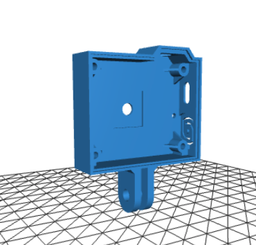

## tCam-Mini
tCam-Mini was created using code from the tCam project and ended up being finished first.  It is a simple device, hardware-wise, consisting of an ESP32 WROVER module, USB UART for programming and debug, Lepton 3.0, 3.1R or 3.5 and supporting voltage regulators and oscillator.

(image courtesy of Group Gets)

Revision 4 of the PCB, along with FW 2.0 and beyond, introduces a new hardware expansion port that can be used by an external micro-controller or single-board computer to communicate with tCam-Mini directly instead of using WiFi.  It also has an I2C expansion port that is currently unused, a USB-C connector and surface-mount LED.

### Firmware
The "Firmware" directory contains a V4.4.4 Espressif ESP32 IDF project for tCam-Mini. You should be able to build and load it into a camera using the IDF commands.  There are also a set of precompiled binaries in the "precompiled" sub-directory.  You can use the Espressif tool and instructions found in the "programming" directory in parallel to this one to load those into a camera without having to build the project.  You can also use the tCam Family Serial Updater tool to load current files from my website.

The precompiled firmware and Windows-based programming application can be downloaded directly from my [website](http://danjuliodesigns.com/products/tcam_mini.html) as well if you don't want to clone this entire repository.  The tCam Family Serial Updater tool can also be [downloaded](https://danjuliodesigns.com/products/tcam.html).

Cameras running FW 2.0 and beyond can also use the over-the-air update capability in the Desktop application to load new firmware files.

This firmware also provides support for an ethernet interface using the built-in ESP32 MAC and an external PHY chip implemented with the tCam-POE PCB.  A GPIO pin is pulled low to indicate the firmware is running on the tCam-POE PCB.

### Hardware
The "Hardware" directory contains PCB and stencil Gerber files, a BOM and a schematic PDF.  These can be used to build a tCam-Mini on the PCB I designed.  Of course you can also buy a pre-assembled unit from [Group Gets](https://store.groupgets.com/products/tcam-mini) with or without the Lepton.  See below for instructions on building one from commonly available development boards.

Note: My interests are in radiometric thermography so I have focused primarily on the Lepton 3.5.  The Lepton 3.0 is supported starting with FW 2.0.  It should be possible for someone to modify my firmware source to work with the Lepton 2 and 2.5 models by modifying the task that reads the lepton (probably easiest to modify the code that reads the data and then just pixel-double it before handing it off to other tasks).  I will be happy to include a link to anyone else's clone of my code that supports these older Leptons.

### Enclosures
Three simple enclosure designs in included in this repository, One designed to be cut on a laser cutter and two designed to be 3D printed.

Github user [zharijs](https://github.com/zharijs) created a set of fantastic 3D printed enclosure designs, with and without GoPro™ mounts, that you can find in his [repo](https://github.com/zharijs/Enclosures/tree/main/tCam%20enclosure). He helpfully includes a BOM for extra hardware you'll need too.  Honestly, his enclosures are better than mine!

### Operation
tCam-Mini is a command-based device.  It is designed for software running on another device to control it and receive responses and image data from it.  The software communicates with tCam-Mini via one of two ways depending on the polarity of the Mode input at boot.

1. Mode bit left disconnected (pulled high) configures communication via WiFi using a socket interface with commands, responses and images encoded as json packets.  Data is not encrypted so appropriate care should be taken.
2. Mode bit low (grounded) configures communication via the Hardware Interface using a serial interface and a slave SPI interface.  Commands and responses are sent as json packets over the serial interface.  A new "image_ready" packet indicates that the controller can read an image from the SPI interface.

The command interface is described in the firmware directory.

#### USB Port
The USB Port provides a USB Serial interface supporting automatic ESP32 reset and boot-mode entry for programming.  It is also used for serial logging output by the ESP32 firmware (115,200 baud).

#### Status Indicator
A dual-color (red/green) LED is used to communicate status.  Combinations of color and blinking patterns communicate various information.

| Status Indicator | Meaning |
| --- | --- |
| Off or Dim | Firmware did not start |
| Solid Red | Firmware is running: initializing and configuring the Lepton and WiFi (when configured to use WiFi) |
| Blinking Yellow | WiFi AP Mode : No client connected to camera's WiFi |
|  | WiFi Client Mode : Not connected to an AP |
| Solid Yellow | WiFi AP Mode : Client connected to camera's WiFi |
|  | WiFi Client Mode : Connected to an AP |
| Solid Green | Wifi Mode : WiFi is connected and external software has connected via the socket interface |
|  | Hardware Interface Mode : Camera is ready for operation |
| Fast Blink Yellow | WiFi Reset in progress |
| Alternating Red/Green | Over-the-air FW update has been requested.  Press the button to initiate the update |
| Blinking Green | FW update in process (blinking my occur at irregular intervals as the Flash memory is written) |
| Series of Red Blinks | A fault has been detected.  The number of blinks indicate the fault type (see table below) |

| Fault Blinks | Meaning |
| --- | --- |
| 1 blink | ESP32 I2C or SPI peripheral initialization failed |
| 2 blinks | ESP32 Non-volatile storage or WiFi initialization failed |
| 3 blinks | ESP32 static memory buffer allocation failed (potential PSRAM issue) |
| 4 blinks | Lepton CCI communication failed (I2C interface) |
| 5 blinks | Lepton VoSPI communication failed (SPI interface) |
| 6 blinks | Internal network error occurred |
| 7 blinks | Lepton VoSPI synchronization cannot be achieved |
| 8 blinks | Over-the-air FW Update failed |

Additional start-up and fault information is available from the USB Serial interface.

#### WiFi
tCam-Mini can act as either an Access Point (creating its own WiFi network) or a client (connecting to an existing WiFi network).  WiFi is enabled when the Mode input is high (left floating) when tCam-Mini boots and operates in the 2.4 GHz band.  The camera acts as an Access Point (AP) by default.  It selects an SSID based on a unique MAC ID in the ESP32 with the form "tCam-Mini-HHHH" where "HHHH" are the last four hexadecimal digits of the MAC ID.  There is no password by default.  When acting as an Access Point, each tCam-Mini always has the same default IPV4 address (192.168.4.1).

It can be reconfigured via a command (for example, from the desktop application) to act as a WiFi Client (STAtion mode) and connect to an existing WiFi network.  When configured as a WiFi Client, it can either get a DHCP served address from the network's router or it can also be reconfigured to have a fixed (static) IPV4 address.  Using a static address makes it easier to connect to tCam-Mini because you don't have to find out what DHCP address the router gave it.

Currently only one device can connect to the camera at a time.

Please see the set of instructions in the DesktopApp folder in this repository for connecting to tCam-Mini in either mode.

#### WiFi Reset Button
Pressing and holding the WiFi Reset Button for more than five seconds resets the WiFi interface back to the default AP mode.  The status indicator will blink a pattern indicating the reset has occurred (see below).

Pressing the button quickly when an OTA FW update has been requested (LED alternating red/green) by the Desktop application initiates the update process.

#### Hardware Interface
The hardware interface is enabled when the Mode input is low (grounded) when tCam-Mini boots.

The serial port (running at 230,400 baud) is used to send and receive commands and responses as described below.  Instead of sending an "image" response over the relatively slow serial port, the firmware sends an "image_ready" response to notify software running on the external system that it can read the image from the slave SPI port using a master SPI peripheral.

The slave SPI port is partially handled by a driver running on the ESP32.  For this reason the highest supported clock rate is 8 MHz.  Too fast and the ESP32 slave SPI driver can't keep up.  I found success running the interface at 7 MHz.

#### mDNS Discovery
The cameras advertise themselves on the local network using mDNS (Bonjour) starting with firmware revision 3.0 to make discovering their IPV4 addresses easier.

* Service Type: "\_tcam-socket._tcp."
* Host/Instance Name: Camera Name (e.g. "tCam-Mini-87E9")
* TXT Records:
	1. "model": Camera model (e.g. "tCam", "tCam-Mini", "tCam-POE")
	2. "interface": Communication interface (e.g. "Ethernet", "WiFi")
	3. "version": Firmware version (e.g. "3.0")

### Previous version

