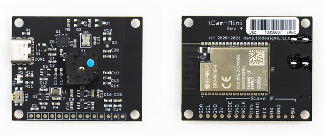
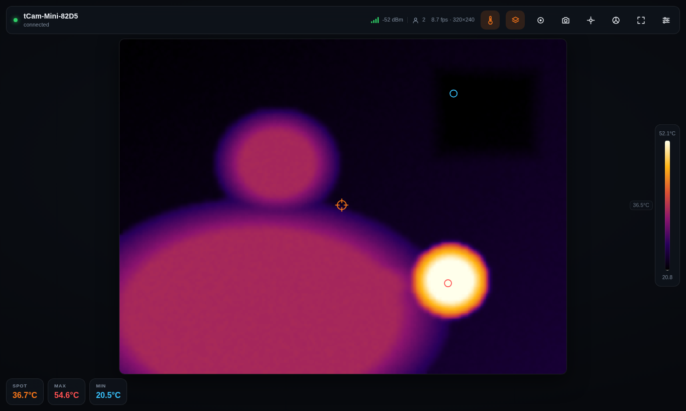
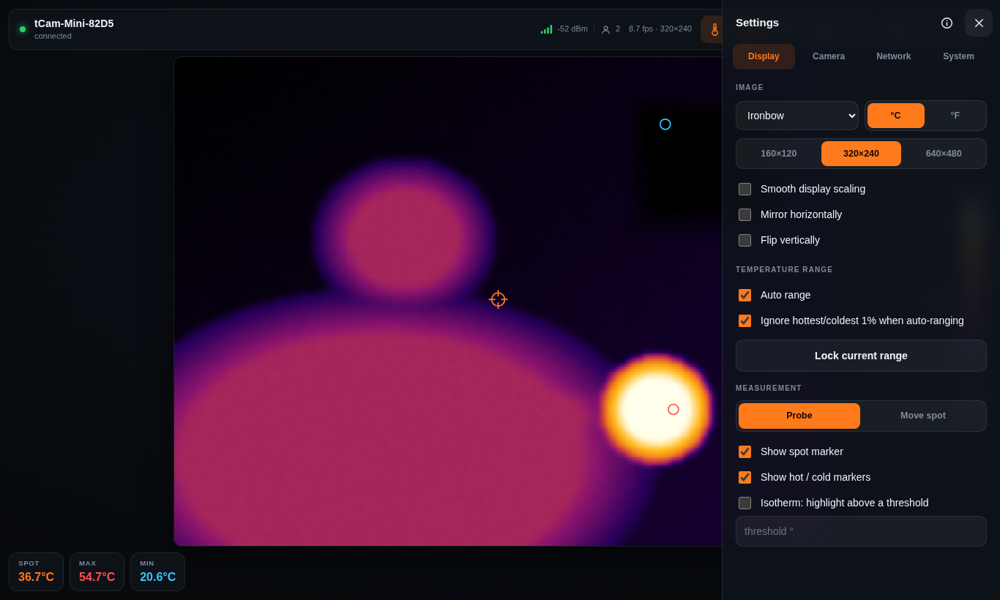
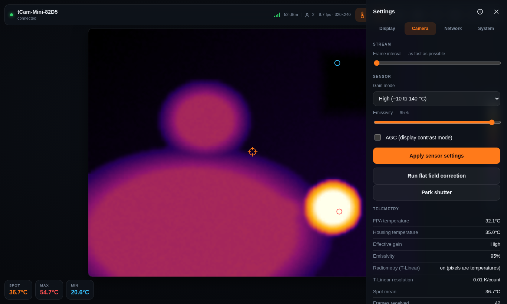
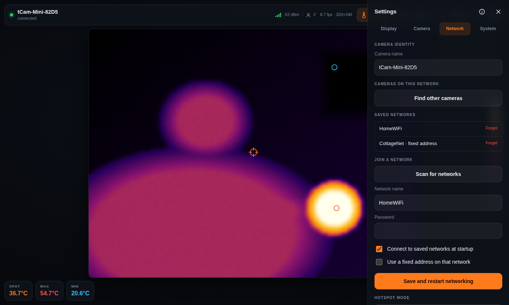
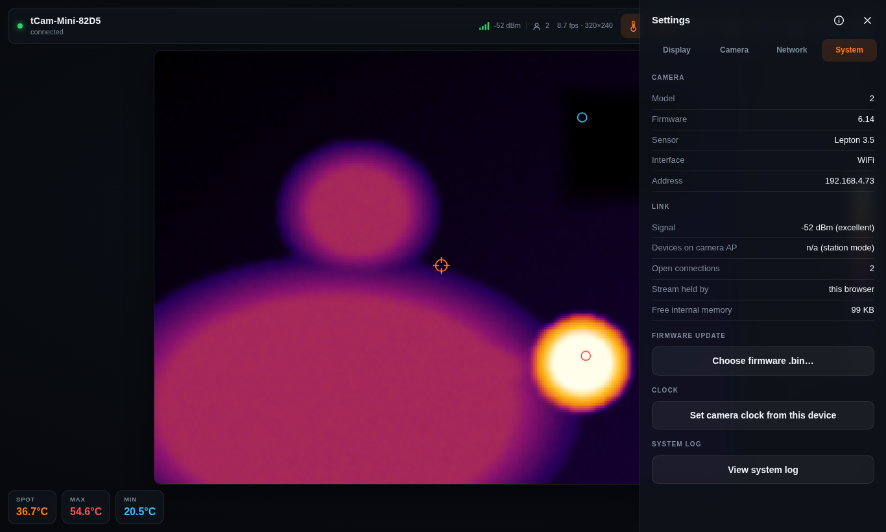
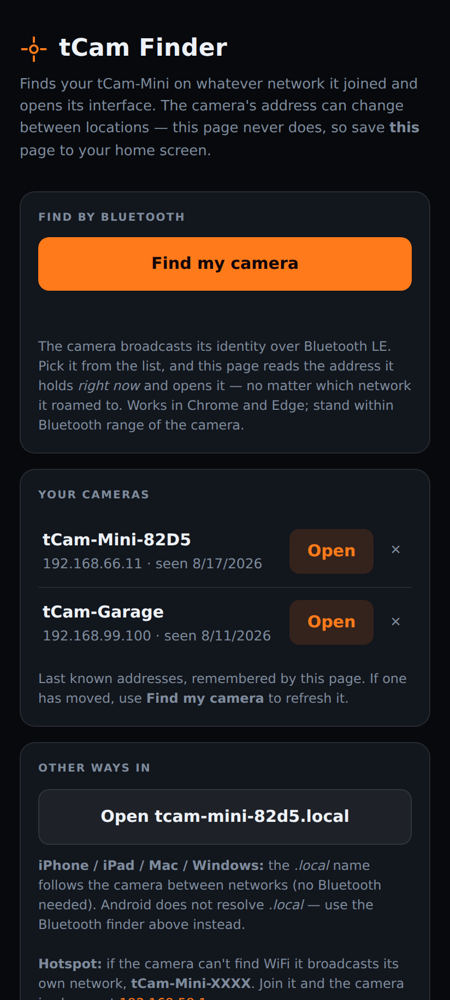
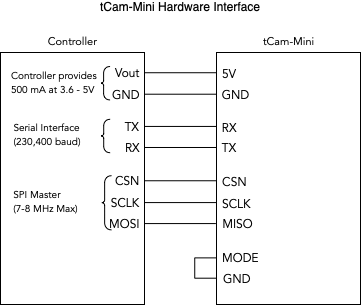
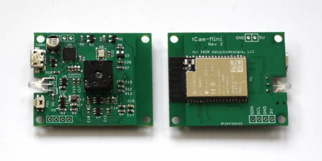

## tCam-Mini
tCam-Mini was created using code from the tCam project and ended up being finished first.  It is a simple device, hardware-wise, consisting of an ESP32 WROVER module, USB UART for programming and debug, Lepton 3.0, 3.1R or 3.5 and supporting voltage regulators and oscillator.

(image courtesy of Group Gets)

Revision 4 of the PCB, along with FW 2.0 and beyond, introduces a new hardware expansion port that can be used by an external micro-controller or single-board computer to communicate with tCam-Mini directly instead of using WiFi.  It also has an I2C expansion port that is currently unused, a USB-C connector and surface-mount LED.

### Firmware

The `firmware` directory contains an **ESP-IDF v5.5** project (this fork's 6.x series — the original 3.x/4.x firmware was an IDF 4.4.4 project, an IDF that reached end of life in 2024).  Build and flash with the standard IDF commands; Windows setup from scratch is documented step by step in [firmware/BUILDING_WINDOWS.md](firmware/BUILDING_WINDOWS.md).

The headline feature of the 6.x firmware is that **the camera serves its own app**.  Any browser — phone, tablet, PC — gets a live radiometric viewer and full configuration with nothing installed:

* Live streaming to up to **four browsers at once** (compact binary WebSocket frames)
* Dark instrument UI: 8 palettes, up to 640×480 bilinear upscale, °C/°F, isotherm alarm, spot meter + probe, hot/cold markers, mirror and vertical flip
* Auto/manual/locked temperature range with 1% outlier clipping
* In-browser **video recording and PNG capture**, with an optional burned-in data overlay (name, timestamp, readouts, scale); raw `.tjsn` frames compatible with the desktop application
* **WiFi roaming**: five saved networks, joins the strongest in sight at power-on, falls back to its own hotspot within seconds when none are visible and keeps rescanning
* Captive portal setup: join the camera's hotspot and the interface opens itself
* **Firmware update from the browser**: upload `tCamMini.bin` on the System tab — safe A/B partitions, an interrupted upload leaves the running firmware untouched
* **System log in the browser** — the serial console without the cable
* Sensor protection: the Lepton's shutter parks over the detector 10 s after the last viewer leaves (sun protection while powered; a stored camera still needs a lens cap)
* The original json command protocol on port 5001 is **unchanged** — the desktop application, Python library and mobile apps keep working

Full interface documentation: [firmware/WEB_UI.md](firmware/WEB_UI.md) · Complete engineering history: [firmware/readme.md](firmware/readme.md)

#### The web interface

| | |
| --- | --- |
|  |  |
| *Display: palette, units, resolution, range, measurement* | *Camera: stream, sensor, live telemetry, capture* |
|  |  |
| *Network: identity, discovery, saved networks, hotspot* | *System: info, link quality, updates, clock, log* |

This firmware also provides support for an ethernet interface using the built-in ESP32 MAC and an external PHY chip implemented with the tCam-POE PCB.  A GPIO pin is pulled low to indicate the firmware is running on the tCam-POE PCB.

### Hardware
The "Hardware" directory contains PCB and stencil Gerber files, a BOM and a schematic PDF.  These can be used to build a tCam-Mini on the PCB I designed.  Of course you can also buy a pre-assembled unit from [Group Gets](https://store.groupgets.com/products/tcam-mini) with or without the Lepton.  See below for instructions on building one from commonly available development boards.

Note: My interests are in radiometric thermography so I have focused primarily on the Lepton 3.5.  The Lepton 3.0 is supported starting with FW 2.0.  It should be possible for someone to modify my firmware source to work with the Lepton 2 and 2.5 models by modifying the task that reads the lepton (probably easiest to modify the code that reads the data and then just pixel-double it before handing it off to other tasks).  I will be happy to include a link to anyone else's clone of my code that supports these older Leptons.

### Enclosures
Three simple enclosure designs in included in this repository, One designed to be cut on a laser cutter and two designed to be 3D printed.

Github user [zharijs](https://github.com/zharijs) created a set of fantastic 3D printed enclosure designs, with and without GoPro™ mounts, that you can find in his [repo](https://github.com/zharijs/Enclosures/tree/main/tCam%20enclosure). He helpfully includes a BOM for extra hardware you'll need too.  Honestly, his enclosures are better than mine!

### Operation

With the 6.x firmware, tCam-Mini is both a self-contained instrument (browse to it, see [firmware/WEB_UI.md](firmware/WEB_UI.md)) and a command-based device for software running elsewhere.  External software communicates one of two ways depending on the polarity of the Mode input at boot:

1. Mode bit left disconnected (pulled high) configures communication via WiFi: the browser interface on port 80, and the original socket interface on port 5001 with commands, responses and images encoded as json packets.  Data is not encrypted so appropriate care should be taken.
2. Mode bit low (grounded) configures communication via the Hardware Interface using a serial interface and a slave SPI interface.  Commands and responses are sent as json packets over the serial interface.  An "image_ready" packet indicates that the controller can read an image from the SPI interface.

The command interface is described in the firmware directory.

#### USB Port
The USB Port provides a USB Serial interface supporting automatic ESP32 reset and boot-mode entry for programming.  It is also used for serial logging output by the ESP32 firmware (115,200 baud).  The same log is also available in the browser (System ▸ View system log).

#### Status Indicator
A dual-color (red/green) LED is used to communicate status.  Combinations of color and blinking patterns communicate various information.  (Verified current for the 6.x firmware.)

| Status Indicator | Meaning |
| --- | --- |
| Off or Dim | Firmware did not start |
| Solid Red | Firmware is running: initializing and configuring the Lepton and WiFi (when configured to use WiFi) |
| Blinking Yellow | WiFi AP Mode : No device joined to the camera's WiFi |
|  | WiFi Client Mode : Not connected to a network (scanning saved networks / raising the recovery hotspot) |
| Solid Yellow | WiFi AP Mode : A device has joined the camera's WiFi |
|  | WiFi Client Mode : Connected to a network.  **Browser viewers run in this state** — the web interface streams over HTTP, not the socket interface |
| Solid Green | WiFi Mode : External software (desktop application, Python library) has connected via the json socket interface on port 5001 |
|  | Hardware Interface Mode : Camera is ready for operation |
| Fast Blink Yellow | WiFi Reset in progress (button held more than five seconds — returns the camera to hotspot mode) |
| Alternating Red/Green | A firmware update has been requested **through the legacy socket protocol** (desktop application).  Press the button to initiate it.  Updates uploaded from the web interface do not use this flow — the LED is unchanged during the upload and the camera simply restarts when it completes |
| Blinking Green | Legacy-protocol FW update in process (blinking may occur at irregular intervals as the Flash memory is written) |
| Series of Red Blinks | A fault has been detected.  The number of blinks indicates the fault type (see table below) |

| Fault Blinks | Meaning |
| --- | --- |
| 1 blink | ESP32 I2C or SPI peripheral initialization failed |
| 2 blinks | ESP32 Non-volatile storage or WiFi initialization failed |
| 3 blinks | ESP32 static memory buffer allocation failed (potential PSRAM issue) |
| 4 blinks | Lepton CCI communication failed (I2C interface) |
| 5 blinks | Lepton VoSPI communication failed (SPI interface) |
| 6 blinks | Internal network error occurred (includes the web server failing to start) |
| 7 blinks | Lepton VoSPI synchronization cannot be achieved |
| 8 blinks | Over-the-air FW Update failed |

Additional start-up and fault information is available from the USB Serial interface and the in-browser system log.

#### WiFi
tCam-Mini can act as either an Access Point (creating its own WiFi network) or a client (connecting to existing WiFi networks).  WiFi is enabled when the Mode input is high (left floating) when tCam-Mini boots and operates in the 2.4 GHz band.  The camera acts as an Access Point (AP) by default.  It selects an SSID based on a unique MAC ID in the ESP32 with the form "tCam-Mini-HHHH" where "HHHH" are the last four hexadecimal digits of the MAC ID.  There is no password by default.  When acting as an Access Point, each tCam-Mini always has the same default IPV4 address, **192.168.58.1** (moved off the original 192.168.4.1 because that subnet collides with the LAN some consumer routers hand out, which made the camera unreachable from dual-homed devices).

As a client, the camera remembers up to **five networks** and at power-on joins the strongest one it can see — one camera moves between locations with no reconfiguration.  Each saved network may use DHCP or its own fixed (static) IPV4 address.  If no saved network is visible, the camera raises its own hotspot within seconds (captive portal included) while continuing to rescan every 30 seconds underneath.  All of this is configured from the browser interface's Network tab; the desktop application's WiFi commands keep working as before.

Up to **four browsers may view and control the camera at once**.  The json socket interface on port 5001 remains single-client, and holds the camera exclusively while a desktop-app session is open.

**Finding a camera whose address changed** (FW 6.15+): a saved browser shortcut freezes an IP address, but a roaming camera's address differs at each location.  The camera therefore advertises a small Bluetooth LE beacon carrying its current name, address and mode, and the hosted **[tCam Finder](https://mcgeaverbeaver.github.io/tCam/)** page ([source in docs/](../docs/)) reads it over Web Bluetooth and opens the camera's interface — a shortcut that keeps working across locations, with no cloud backend.  Bluetooth carries discovery only; video still streams over WiFi.  Apple devices (no Web Bluetooth) use the `.local` name instead, which mDNS keeps current.

| | |
| --- | --- |
|  |  |
| *The finder page.* | *[▶ Watch the demo](https://youtube.com/shorts/R_bb3d-skMs)* |

#### WiFi Reset Button
Pressing and holding the WiFi Reset Button for more than five seconds resets the WiFi interface back to the default AP (hotspot) mode.  The status indicator blinks fast yellow while the reset occurs.

Pressing the button quickly when a legacy-protocol OTA FW update has been requested (LED alternating red/green) initiates that update.  Web-interface updates need no button press.

#### Hardware Interface
The hardware interface is enabled when the Mode input is low (grounded) when tCam-Mini boots.

The serial port (running at 230,400 baud) is used to send and receive commands and responses as described below.  Instead of sending an "image" response over the relatively slow serial port, the firmware sends an "image_ready" response to notify software running on the external system that it can read the image from the slave SPI port using a master SPI peripheral.

The slave SPI port is partially handled by a driver running on the ESP32.  For this reason the highest supported clock rate is 8 MHz.  Too fast and the ESP32 slave SPI driver can't keep up.  I found success running the interface at 7 MHz.

#### mDNS Discovery
The cameras advertise themselves on the local network using mDNS (Bonjour) to make discovering their addresses easier.  The 6.x firmware advertises the browser interface as well, so the camera also appears at `http://<camera-name>.local` and in network browsers.

* Service Type: "\_tcam-socket._tcp." (command interface) and "\_http._tcp." (web interface)
* Host/Instance Name: Camera Name (e.g. "tCam-Mini-87E9")
* TXT Records:
	1. "model": Camera model (e.g. "tCam", "tCam-Mini", "tCam-POE")
	2. "interface": Communication interface (e.g. "Ethernet", "WiFi")
	3. "version": Firmware version (e.g. "6.14")

The web interface's Network tab also has a **Find other cameras** button that runs this discovery from the camera itself, since browsers cannot speak mDNS.

### Previous version

