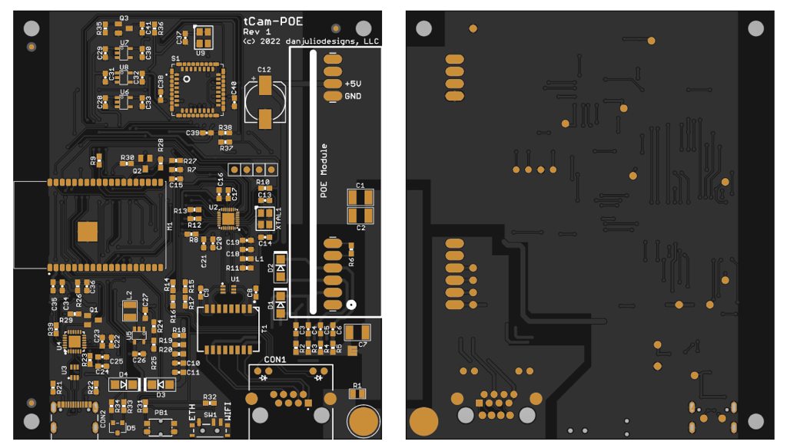
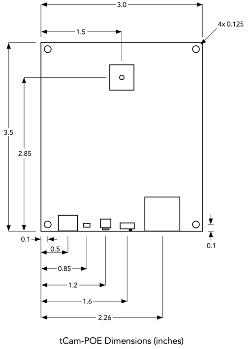

# tCam-POE Hardware 
This directory contains design files for tCam-POE including PCB and stencil Gerber files, a BOM and schematic.

### Header Connections

#### POE Module
The POE module footprint is compatible with several devices from different manufacturers such as Winchen Electronics, Ring&Tone and Silvertel.  I tested with the Silvertel AG9705-2BR and the Winchen WC-PD13C050S.  From a spec perspective both the Ring&Tone RT9460-5V and RT9400-5V, and Silvertel AG9705-FL should work as well.  Optional resistor R6 can be used to program the power classification class (see the Ag9700 spec).

#### I2C Interface
The camera's internal I2C interface and a 3.0V power supply is available for external I2C peripherals.  Power is supplied by the linear regulator that is also supplying the Lepton's VDDIO pad (used for the IO voltage and shutter) and should be limited to 50 mA or less.

