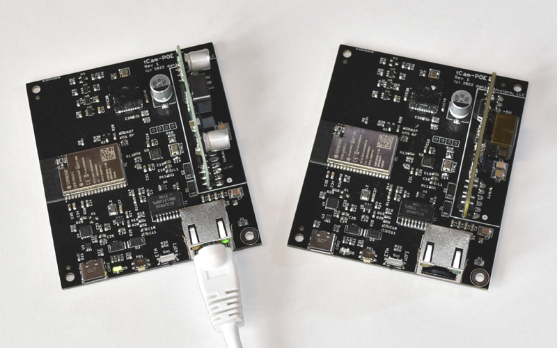

## tCam-POE
tCam-POE was created by extending the tCam-Mini base code to support an ethernet connection using the ESP32 ethernet interface and an external PHY chip.  It is essentially a tCam-Mini extended with the PHY chip, ethernet magnetics and connector, and support for a common footprint IEEE802.3af POE 5V converter module.



### Firmware
tCam-POE runs the same firmware as tCam-Mini starting with the version 3.0 release. The firmware identifies the type of hardware platform it is running on by detecting a GPIO pin pulled low on the tCam-POE PCB.  The pin is pulled high by an ESP32 internal pull-up on the tCam-Mini boards.

Please see the tCam-Mini Firmware section for a full description of the firmware functionality and command set.

### Hardware
The "Hardware" directory contains PCB and stencil Gerber files, a BOM and a schematic PDF.  These can be used to build a tCam-POE on the PCB I designed.  It is possible to build this camera using the Espressif ESP32 POE development board and a Lepton breakout board.  See the firmware ```system_config.h``` file for the GPIO assignments to use when connecting the breakout board and configuring the camera. 

### Operation
tCam-Mini is a command-based device.  It is designed for software running on another device to control it and receive responses and image data from it.  The software communicates with tCam-Mini via one of two ways determined by the position of switch SW1 at power on (as the ESP32 boots).

1. ETH position enables the ethernet interface.
2. WIFI position enables the Wifi interface.

The command interface is described in the tCam-Mini firmware directory.

#### Ethernet Port
The ethernet port support an IEEE 803.2 10/100 Mbps ethernet interface.  An optional IEEE802.3af compliant isolated DC-DC converter may be installed enabling power-over-ethernet functionality. Without the DC-DC converter, the board must be powered via the USB port.

#### USB Port
The USB C Port provides a USB Serial interface supporting automatic ESP32 reset and boot-mode entry for programming.  It is also used for serial logging output by the ESP32 firmware (115,200 baud).

#### Status Indicator
A dual-color (red/green) LED is used to communicate status.  Combinations of color and blinking patterns communicate various information.

| Status Indicator | Meaning |
| --- | --- |
| Off or Dim | Firmware did not start |
| Solid Red | Firmware is running: initializing and configuring the Lepton and Ethernet or WiFi interfaces |
| Blinking Yellow | Ethernet Mode : No ethernet network detected |
|  | WiFi AP Mode : No client connected to camera's WiFi |
|  | WiFi Client Mode : Not connected to an AP |
| Solid Yellow | Ethernet Mode : Ethernet is connected and the camera has an IP address |
|  | WiFi AP Mode : Client connected to camera's WiFi |
|  | WiFi Client Mode : Connected to an AP |
| Solid Green | Ethernet Mode : Ethernet is connected and external software has connected via the socket interface |
|  | Wifi Mode : WiFi is connected and external software has connected via the socket interface |
| Fast Blink Yellow | Network Reset in progress |
| Alternating Red/Green | Over-the-air FW update has been requested.  Press the button to initiate the update |
| Blinking Green | FW update in process (blinking my occur at irregular intervals as the Flash memory is written) |
| Series of Red Blinks | A fault has been detected.  The number of blinks indicate the fault type (see table below) |


| Fault Blinks | Meaning |
| --- | --- |
| 1 blink | ESP32 I2C or SPI peripheral initialization failed |
| 2 blinks | ESP32 Non-volatile storage or Network initialization failed |
| 3 blinks | ESP32 static memory buffer allocation failed (potential PSRAM issue) |
| 4 blinks | Lepton CCI communication failed (I2C interface) |
| 5 blinks | Lepton VoSPI communication failed (SPI interface) |
| 6 blinks | Internal network error occurred |
| 7 blinks | Lepton VoSPI synchronization cannot be achieved |
| 8 blinks | Over-the-air FW Update failed |

Additional start-up and fault information is available from the USB Serial interface.

#### Ethernet
tCam-POE can obtain a DHCP served address from a router on the network or may be configured with a static IP address.

#### WiFi
tCam-POE can act as either an Access Point (creating its own WiFi network) or a client (connecting to an existing WiFi network).  It operates in the 2.4 GHz band. The camera acts as an Access Point (AP) by default.  It selects an SSID based on a unique MAC ID in the ESP32 with the form "tCam-Mini-HHHH" where "HHHH" are the last four hexadecimal digits of the MAC ID.  There is no password by default.  When acting as an Access Point, each tCam-POE always has the same default IPV4 address (192.168.4.1).

It can be reconfigured via a command (for example, from the desktop application) to act as a WiFi Client (STAtion mode) and connect to an existing WiFi network.  When configured as a WiFi Client, it can either get a DHCP served address from the network's router or it can also be reconfigured to have a fixed (static) IPV4 address.  Using a static address makes it easier to connect to tCam-POE because you don't have to find out what DHCP address the router gave it.

Currently only one device can connect to the camera at a time.

#### Network Reset Button
Pressing and holding the Network Reset Button for more than five seconds resets the network interface back to the default mode.  For ethernet mode this means the camera will request a DHCP served address.  For Wifi mode this means the camera will act as Access Point.  The status indicator will blink a pattern indicating the reset has occurred (see below).

Pressing the button quickly when an OTA FW update has been requested (LED alternating red/green) by the Desktop application initiates the update process.

#### mDNS Discovery
The cameras advertise themselves on the local network using mDNS (Bonjour) starting with firmware revision 3.0 to make discovering their IPV4 addresses easier.

* Service Type: "\_tcam-socket._tcp."
* Host/Instance Name: Camera Name (e.g. "tCam-Mini-87E9")
* TXT Records:
	1. "model": Camera model (e.g. "tCam", "tCam-Mini", "tCam-POE")
	2. "interface": Communication interface (e.g. "Ethernet", "WiFi")
	3. "version": Firmware version (e.g. "3.0")

