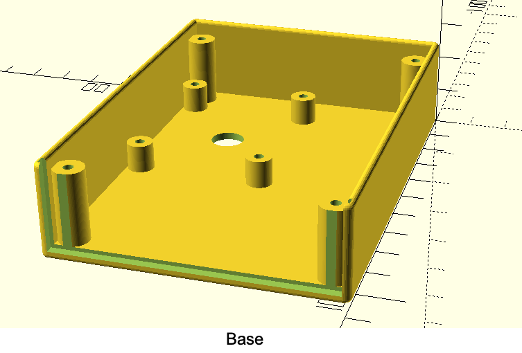
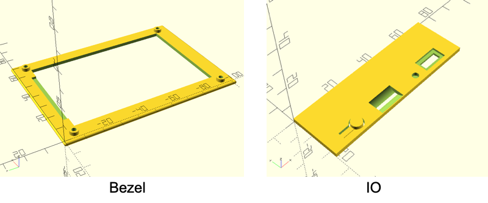
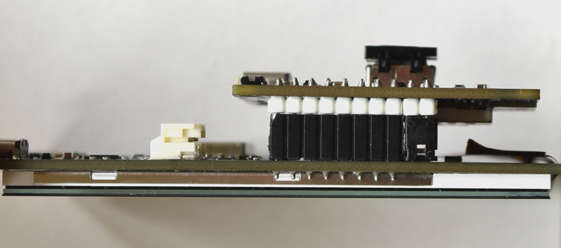
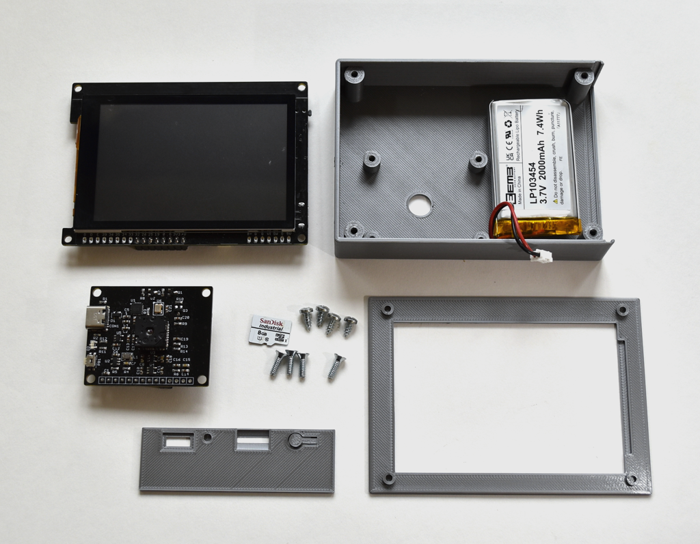
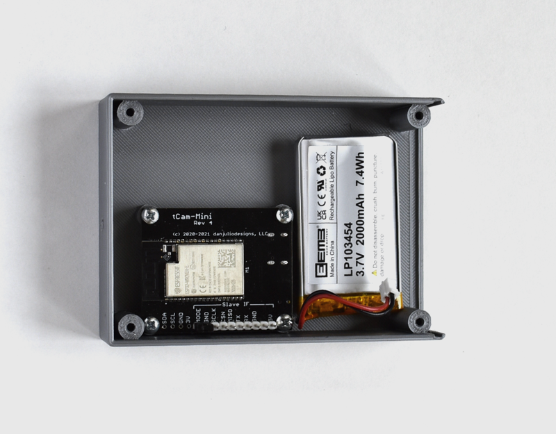
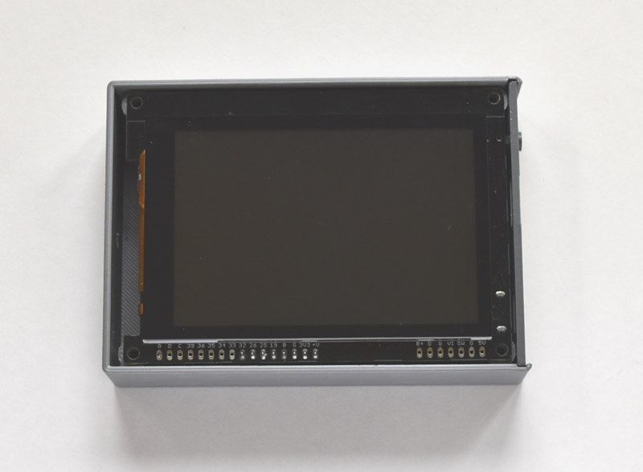
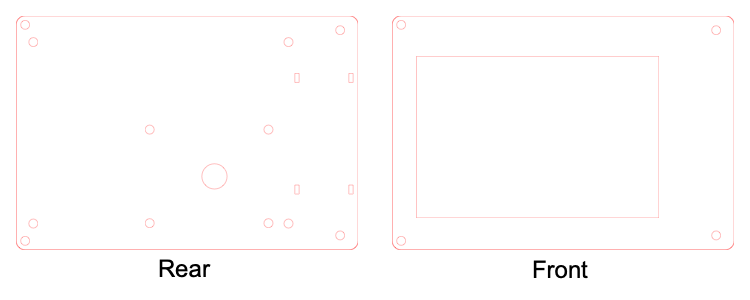
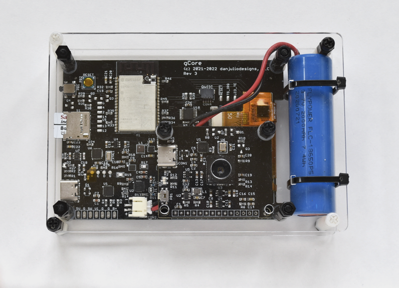
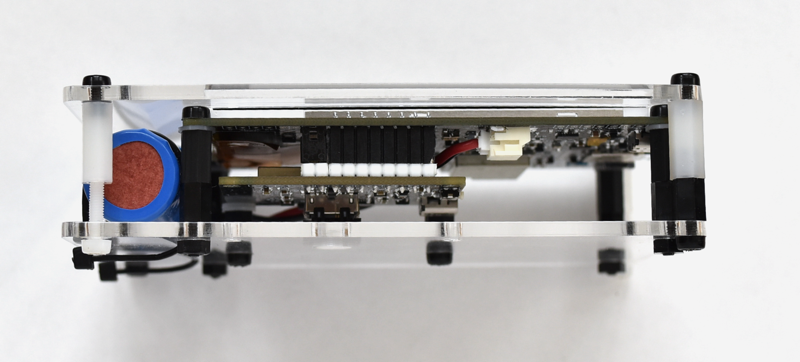
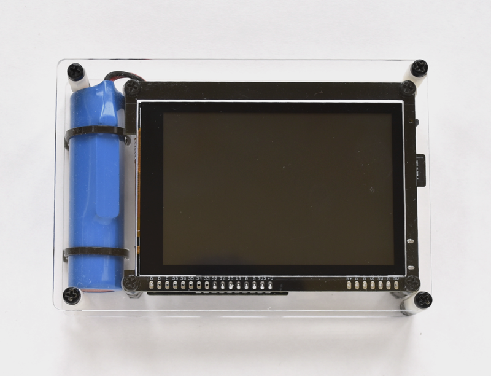

## tCam Enclosures

My usual disclaimer: I'm not a mechanical engineer...

### FDM Enclosure
A simple 3-piece enclosure designed to be 3D printed.  Design was done with OpenSCAD and is based on the gCore enclosure.  The OpenSCAD source and STL files are included in the ```tcam_fdm``` directory.





#### Parts

1. Electronics as described in the main tCam respository
2. 3.7V flat LiPo battery with Sparkfun/Adafruit connector pin-out.  I recommend about a 2000 mAh capacity.  It has to fit in the enclosure as shown in the pictures below so should be approx 54x36x10 mm or smaller.
3. 4x 4-40 x 3/16" pan-head Type A (pointy) screws for mounting tCam-Mini.
4. 4x 4-40 x 1/4" flat-head Type Z screws for securing gCore and the Bezel to the Base.



#### Assembly Pictures







Take care screwing the Base to the Bezel as it is easy to twist off the mounting points on the bezel or to deform the front of the bezel.  It may be easier to carefully screw into the bezel and the remove the screws before completing the assembly.

### Laser Cut Enclosure
A 2-piece enclosure (front/back) designed to be cut on a laser cutter.  The SVG and DXF files are included in the ```tcam_laser``` directory.



#### Parts

1. Electronics as described in the main tCam respository
2. 3.7V Li-Ion 18650 cell with Sparkfun/Adafruit connector pin-out.
3. Two 0.1" wide zip-ties to secure the battery.
4. Nylon stand-offs, screws, nuts and washers.  I kludged together the stand-offs from two cheap kits I had from Amazon. You'll need 2 or 4 to mount tCam-Mini, 4 to mount gCore and 4 to hold the front and back together.  See below for the lengths I cobbled together.

| Connection | Distance |
| --- | --- |
| tCam-Mini - Front | 0.3" / 7.62mm |
| gCore - Front | 0.74" / 18.8mm |
| Front - Rear | 0.9" / 22.9mm |

#### Assembly Pictures





