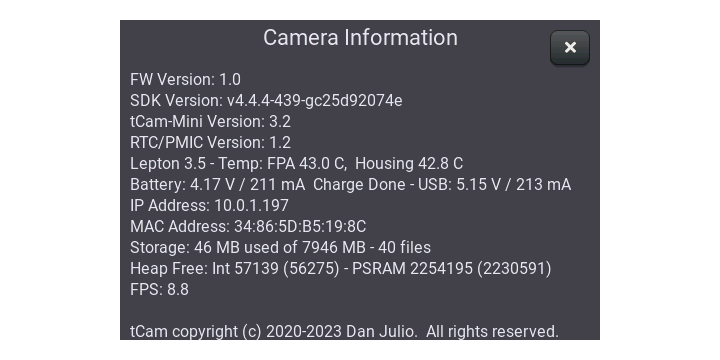

## tCam
tCam is a thermal imaging camera comprised of the hardware components [gCore](https://github.com/danjulio/gcore) and tCam-Mini, and the firmware in this directory.


### Firmware
The "Firmware" directory contains a V4.4.2 Espressif ESP32 IDF project for tCam. You should be able to build and load it into a camera using the IDF commands.  There are also a set of precompiled binaries in the "precompiled" sub-directory.

#### Initial firmware load
There are three ways to initially load the tCam firmware onto a gCore (which comes with different firmware loaded initially).

1. Use the ESP32 IDF ```idf.py``` tool to load the firmware if you are building it yourself.  This is described in the firmware directory.  If you know what you are doing you can also use this tool to load the precompiled binary images.
2. Use the Windows-only Espressif tool and instructions found in the "programming" directory in parallel to this one to load the precompiled binary images onto a gCore without having to build the project.
3. Use the multi-platform tCam Family Serial Updater utility I wrote also found in the "programming" directory. It automatically downloads the most current firmware binaries from my website and writes them to a gCore (it can also load tCamMini firmware into tCam-Mini or tCam-POE boards).  It runs on 64-bit  Linux x86, Mac OS X and Windows computers.  It's the easiest way.  Just select the serial port and hit program.

The tCam Family Serial Updater, precompiled firmware, and Windows-based programming application can also be downloaded individually from my [website](http://danjuliodesigns.com/products/tcam.html) as well if you don't want to clone this entire repository.

#### OTA firmware loads

Over-the-air (OTA) updates can be used to load new firmware using the Desktop application once the tCam firmware has been initially loaded on gCore.

#### tCam-Mini compatibility

The connected tCam-Mini should be running FW 3.1 or later.

### Hardware
The minimum hardware for tCam is a gCore, a Revision 4 PCB tCam-Mini, Li-Ion or LiPo battery and connecting wires or headers.  An optional micro-SD card can be used to locally store images or videos.  Depending on the enclosure it may be helpful to also connect an external push-button the the SW/GND terminals on gCore so that gCore's power button is easily accessible.  The power button serves double duty.  It is used to turn the camera on and once on it is used to take a picture or start/stop a video recording (holding it for longer than 5 seconds will turn off power).

The connections between gCore and tCam-Mini are shown below.  A jumper between the MODE connection and GND on tCam-Mini configures it to use the hardware interface.


gCore's USB connector is used to charge the battery or power the camera from a mains connection.

The hardware interface on tCam-Mini Revision 4 was designed to mate directly with gCore GPIO pins as shown in the following images with the following headers.

1. 8-pin 0.1" (2.54mm) female header soldered on the gCore component side starting with the SW V+ connection. 
2. 10-pin 0.1" male header soldered on the ESP32 side of tCam-Mini in the Slave IF connections (the I2C expansion connections are unused).  I use 6.2 mm height pins.
3. 2-pin 0.1" jumper attached to the MODE and GND pins of the tCam-Mini header.


#### Important Notes

1. Never connect USB Power to tCam-Mini when it is attached to gCore.  Doing so will back-power gCore and will damage it and/or the battery.  Only connect USB power to gCore.
2. Be very careful with the tCam-Mini when soldering the header.  The Lepton is very fragile and it is easy to damage the shutter with too much pressure (I know...).  Probably best if you carefully remove it before soldering on the header and then carefully re-install it (making sure it is fully inserted into the socket) before installing tCam-Mini into the enclosure.
3. Remember to remove the jumper when removing tCam-Mini from gCore if you wish to use it with WiFi again and then re-install it before re-attaching to gCore (I forgot this all the time...).

### Enclosures
Two simple enclosure designs in included in this repository, one designed to be cut on a laser cutter and one designed to be 3D printed.

### Operation
tCam may be controlled locally using the graphics user interface or remotely using a command-based interface available via WiFi.  GUI operation is described below.  The command interface is described in the firmware directory.

#### gCore Power Button
The gCore power button provides multiple functions.

1. Power on
2. Shutter control (short press while camera is operating)
3. Hard power off (held longer than five seconds causes gCore to switch power off)

#### gCore Micro-SD Card
Images and video files can be stored, played back and retrieved by software over the WiFi interface.  Files are the same format (.tjsn and .tmjsn) as used by the Desktop and Mobile applications.  Filenames are created from the image timestamp and stored in directories created from the date portion of the timestamp.

#### gCore USB Connector
The gCore USB connector is used to provide power to the camera, charge the battery and as a programming/diagnostic interface for the tCam code running on gCore.

I advise closing the charge current jumper (J1) on gCore allowing 1A maximum charge current for LiPo batteries larger than 2000 mAh and leaving it open for smaller batteries.

Diagnostic information is output on the USB serial port at 115,200 baud.

#### gCore WiFi
tCam can act as either an Access Point (creating its own WiFi network) or a client (connecting to an existing WiFi network) or WiFi may be disabled.  It operates in the 2.4 GHz band.  The camera acts as an Access Point (AP) by default.  It selects an SSID based on a unique MAC ID in the ESP32 with the form "tCam-HHHH" where "HHHH" are the last four hexadecimal digits of the MAC ID.  There is no password by default.  When acting as an Access Point, each tCam always has the same default IPV4 address (192.168.4.1).

It can be reconfigured via the GUI or a command (for example, from the desktop application) to act as a WiFi Client (STAtion mode) and connect to an existing WiFi network.  When configured as a WiFi Client, it can either get a DHCP served address from the network's router or it can also be reconfigured to have a fixed (static) IPV4 address.  Using a static address makes it easier to connect to tCam because you don't have to find out what DHCP address the router gave it by logging into the router or using a utility like the Fing Android app or nmap on Linux.

Currently only one device can connect to the camera at a time.

Please see the set of instructions in the DesktopApp folder in this repository for connecting to tCam in either mode.

##### mDNS Discovery
tCam cameras advertise themselves on the local network using mDNS (Bonjour) to make discovering their IPV4 addresses easier.

* Service Type: "\_tcam-socket._tcp."
* Host/Instance Name: Camera Name (e.g. "tCam-198D")
* TXT Records:
	1. "model": Camera model (tCam returns "tCam")
	2. "interface": Communication interface (tCam returns "WiFi").
	3. "version": Firmware version (e.g. "1.0")

#### gCore NVRAM / NVFlash
tCam settings are stored in gCore's NVRAM and written to the NVFlash when the camera is switched off.

### Graphical User Interface
tCam displays several screens in order to view the stream coming from the attached tCam-Mini, configure the camera or browse stored images and videos.

#### Main Screen
The Main Screen is displayed when tCam is turned on.


| Control | Description |
|---|---|
| AGC/RAD | Toggles between Radiometric and AGC modes in the Lepton sensor. |
| Battery Level/Charge | A battery indicator shows the current charge level in 25% increments.  A charge indicator (not shown above) indicates when the battery is charging. |
| Browse | Displays last recorded image or movie on the Browse Screen. |
| FFC | Initiate a manual flat-field correction in the Lepton sensor. |
| Image/Movie | Toggles between recording image (.tjsn) files or movies (.tmjsn) to the Micro-SD card when Shutter button is pressed (or remote command issued). |
| Manual/Auto Range | Toggles between Manual Range and Automatic Range for image mapping to the selected palette.  Automatic Range maps the image to the palette using the minimum and maximum temperatures found in each image.  Manual Range allows establishing a set minimum and maximum temperature used to map the image to the palette.  This is helpful when recording to prevent colors from jumping all over the place or when imaging a scene with a range of temperatures you wish to exclude.  Manual Range is sometimes called Span Locking.  Clicking the MR button will set a manual range rounded up and down from the current image. |
| Micro-SD Card | The SD Card icon is shown when a Micro-SD card is inserted and the camera can record images or movies. |
| Palette Bar | Displays the current selected pseudo-color mapping palette.  Clicking either the top or bottom of the palette will select the next or previous palette in the set of palettes provided by tCam. The spotmeter temperature within the range is indicated by the marker to the right of the bar. For radiometric images the image minimum and maximum temperatures are shown at the bottom/top of the palette.  For AGC images the word "AGC" is displayed at the bottom.  If running a tCam-Mini with a Lepton 3.0 then the word "RAW" is displayed at the bottom of the bar. |
| Power Off | Turns the camera off (soft power off).  Use this instead of holding the power button for five seconds to ensure any changed settings are saved in NVFlash. |
| Settings | Displays the main Settings Screen. |
| Spotmeter | The spotmeter displays the temperature in a 2x2 pixel area of the image marked with the small square.  Tapping the spotmeter temperature will blank the spotmeter.  Tapping the image will relocate the spotmeter marker (and redisplay the spotmeter temperature if it has been blanked). |
| Time | The camera time (hours and minutes) is shown.  Important to set the time (the applications do it automatically) because it is used to timestamp images. |
| WiFi Status | The WiFi SSID is shown in white when WiFi is enabled (either the camera name for AP mode or the WiFi name for client/station mode).  The status turns green when a software program is connected to the camera. |

The area under the spotmeter temperature is used to display temporary status messages including a new palette when one is selected or the filename of an image or video when the shutter button is pressed.  The message is displayed for about a second.


#### Settings Screen
The Settings Screen is used to configure the camera.


| Control | Description |
| --- | --- |
| CLOCK | Displays the Clock Setup Screen. |
| Display Brightness | Sets the LCD backlight brightness. |
| Emissivity | Displays a numeric keypad screen to enter an emissivity value for the Lepton. |
| Gain | Select the Lepton Gain (Auto, Low, High) using a drop-down menu. |
| INFO | Displays the Camera Information Screen. |
| LOOKUP | Displays the Emissivity Lookup Screen which contains a list of materials which can be selected to set an appropriate emissivity value. |
| Man Range | Enable or disable Manual Range. |
| Man Range Min | Displays a numeric keypad screen to enter a minimum temperature for Manual Range (in the current units). |
| Man Range Max | Displays a numeric keypad screen to enter a maximum temperature for Manual Range (in the current units). |
| Metric | Toggles between Imperial and Metric units (°F or °C). |
| NETWORK | Displays the Network Setup Screen. |
| Record Interval | Select the rate to store images when recording a movie using a drop-down menu.  The rate can vary from the fastest (~8.8 FPS) to one image every five minutes. |
| STORAGE | Displays the Manage Storage Screen. |
| WIFI | Displays the WiFi Setup Screen. |
| X | Exit back to Main Screen |

Settings changed directly on this screen are applied (and saved) when the Exit button is pressed.

The numeric entry screens for Emissivity, Min and Max Range look like the following.


The 'X' button returns to the previous screen without change.  The 'C' button clears the value.  The backspace button clears the last entered number.  The checkmark button saves the new setting and returns to the previous screen.

#### Browse Screen
The Browse Screen is used to view files on the Micro-SD card.  When displayed it shows the last recorded image or video.  The Browse Screen displaying an image file is shown below.


| Control | Description |
|---|---|
| Delete File | Deletes the currently shown file.  A confirmation dialog box is displayed allowing you to cancel. |
| Directory / Filename | Displays the current image's directory (folder) and filename on the Micro-SD card. |
| File Back/Forward | Displays the previous or next file. |
| Manage Storage | Displays the Manage Storage Screen where directories and files can be seen. |
| Manual/Auto Range | As with the Main Screen, toggles between Manual Range and Automatic Range for image mapping to the selected palette.  Useful while viewing a movie to prevent changes in scene temperature range from radically changing the color mapping as the movie plays. |
| Palette Bar | As with the Main Screen, displays the current selected pseudo-color mapping palette.  Clicking either the top or bottom of the palette will select the next or previous palette in the set of palettes provided by tCam.  The current Main Screen palette is used when entering the Browse Screen. |
| Spotmeter | Displays the spotmeter value recorded in the current image.  The spotmeter location cannot be changed although tapping the spotmeter temperature readout will blank the spotmeter and touching the image will redisplay it. |
| X | Exit back to Main Screen |

An additional Play/Stop button and current timestamp is displayed when viewing a movie as shown below.


#### WiFi Setup Screen
The WiFi Setup Screen configures tCam's 2.4 GHz WiFi interface.  Touching the SSID or PW textfield allows changing that field using the keyboard.


| Control | Description |
|---|---|
| Alpha/Num | Toggle the keyboard between alphabetical or numeric/punctuation character sets. |
| AP | Configure the WiFi interface as an Access Point (AP) advertising its SSID as a WiFi network or as a client (STAtion mode) connecting to an existing WiFi network. |
| Caps | Toggle between alpha text in capital or lower-case mode. |
| Cursor Left/Right | Non-destructively move the cursor one position to the left or right in the selected text field. |
| Delete | Destructive backspace for the cursor in the selected SSID or PW text field. |
| Enable | Enable or disable the WiFi interface. |
| Exit | Discard any changes and return to the Settings Screen. |
| Scan | Start a scan for existing WiFi networks.  tCam displays a spinner above the Scan List while the scan is in progress and disconnects from any existing networks. Scan is only available when the camera is not in AP mode. |
| Scan List | Displays a scrollable list of SSIDs discovered during a scan.  Click an entry to load it into the SSID text field. |
| Show/Hide | Toggles visibility of the password text field. |
| Save | Save any changes and return to the Settings Screen. The WiFi subsystem is restarted with the new configuration. |

#### Network Setup Screen
The Network Setup Screen is used to configure a static IPV4 address when the WiFi is operating as a client to another network.  Decimal numbers (0-255) are entered into each of the four octets for the IP Address and Netmask.  When not enabled the camera will request a DHCP served address from the network router.


| Control | Description |
|---|---|
| Delete | Destructive backspace for the cursor in the selected IP Address or Netmask text field. |
| Enable | Enable or disable a static IP address when operating in STAtion mode. |
| Exit | Discard any changes and return to the Settings Screen. |
| IP Address | The static IP address.  Make sure you pick a number outside the range the router might assign using DHCP. |
| Netmask | The network netmask.  Typically 255.255.255.0. |
| Octet Left/Right | Move the cursor to the previous or next octet. |
| Save | Save any changes and return to the Settings Screen. |

#### Clock Setup Screen
The Clock Setup Screen is used to manually set the Real Time clock.  The time and date are used to timestamp images and videos.  The numeric keypad is used to enter the time.  The current digit is highlighted.  The time is also automatically set by the Desktop and mobile apps.


| Control | Description |
|---|---|
| Date | Camera date in the form MM:DD:YY where YY is a year in the 21st century. |
| Exit | Discard any changes and return to the Settings Screen. |
| Prev/Next Digit | Move the currently selected (highlighted) character back or forward one position. |
| Save | Save any changes and return to the Settings Screen. |
| Time | Camera time in the form HH:MM:SS where HH is in 24-hour format (0-23). |

#### Manage Storage Screen
The Manage Storage Screen lists folders and files and allows operations on those items.  The Screen displays all existing Folders.  Selecting a Folder displays the files in that folder.  Selecting a file allows that file to be viewed in the Browse Screen.


| Control | Description |
|---|---|
| Browse | Available when a file has been selected.  Displays the file in the Browse Screen. |
| Delete | Available when either a Folder or a File has been selected.  Deletes the entire Folder if only a Folder has been selected.  Deletes the file is it has been selected.  A confirmation dialog is displayed before the delete operation. |
| Exit | Returns to the Settings Screen. |
| File List | List of files in the selected Folder. |
| Folder List | List of folders on the Micro-SD card. |
| Format | Formats the Micro-SD card. A confirmation dialog is displayed before the format operation. |

#### Emissivity Lookup Screen
The Emissivity Lookup Screen displays a scrollable list of materials.  Selecting a material shows its emissivity value.  This can be saved and set as the camera's emissivity value by clicking the checkmark.  Clicking the X button exits the screen without saving the value.  The values were taken from a Fluke emissivity table and a Mikron emissivity list (but as you all know, emissivity is a complex thing).


#### Camera Information Screen
The Camera Information Screen displays version and some operating information about the camera.  The information on this screen is one thing I'm gonna ask for if you email me with issues :-)



It can also be used to reset the camera to factory default values by tapping on the "Camera Information" title five times quickly.  A dialog box allows you to cancel.


#### Firmware Update Confirmation
An OTA firmware update displays the following confirmation.  If confirmed then the camera shows a progress bar followed by a reboot when the new firmware has been successfully downloaded.

